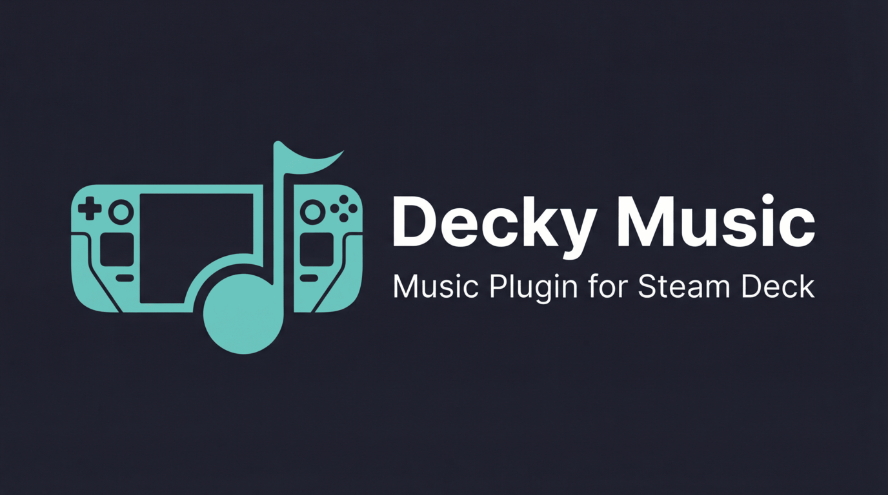

# Decky Music 插件

<p align="center">
  
</p>

在 Steam Deck 上享受音乐的 Decky Loader 插件。

## ✨ 功能特性

- 🎵 **多平台支持** - 同时支持 **QQ 音乐** 和 **网易云音乐**，双平台资源深度集成
<!-- - 🔄 **自动兜底 (Fallback)** - 当主平台音源无法播放或缺失歌词时，自动尝试从备用平台获取，确保顺畅体验 -->
- 🔐 **扫码登录** - 支持 QQ、微信及网易云扫码登录，安全便捷
- 📅 **个性化推荐** - 每日推荐歌曲、精选歌单、智能“猜你喜欢”
- 📂 **我的音乐** - 完整支持个人收藏歌曲、自建歌单及收藏歌单
- 🔍 **智能搜索** - 支持关键词搜索、搜索建议及热门搜索列表
- 🎭 **全屏播放器** - 沉浸式全屏界面，支持**逐字歌词 (QRC/KRC)**、标准歌词及歌词翻译
- 🕒 **播放历史** - 自动记录最近播放的歌曲，随时找回心头好
- ⚙️ **高度可定制** - 可自由设置主平台、兜底顺序及首选音质

## 📦 安装

### 前提条件

- Steam Deck 已安装 [Decky Loader](https://github.com/SteamDeckHomebrew/decky-loader)
- Node.js v16.14+ 和 pnpm v9
- Python 3.11 (Steam Decky 使用的是 3.11 版本)

### 从 Release 安装（推荐）

1. 从 [Releases](https://github.com/jinzhongjia/decky-music/releases) 下载最新的 `DeckyMusic.zip`
2. 使用 Steam Decky 的开发者模式安装本插件

### 从源码构建

> ⚠️ 注意：使用 Docker 构建，确保已安装 Docker。

**方法 1：使用 GitHub Actions（推荐）**

Fork 此仓库后，GitHub Actions 会自动构建。创建 tag 时会自动发布 Release。

**方法 2：本地构建**

需要安装 [mise](https://mise.jdx.dev/) 和 Docker。

```bash
git clone https://github.com/your-username/decky-music.git
cd decky-music

# 构建
mise run build

# 输出文件: out/DeckyMusic.zip 和 out/DeckyMusic/
```

## 🎮 使用方法

### 登录与设置

1. 打开 Steam Deck 的游戏模式，按下 `...` 按钮打开快速访问菜单。
2. 切换到 Decky 插件标签页，找到并打开 **Decky Music**。
3. 进入 **Provider 设置**：
   - 分别进行 **QQ 音乐**（支持 QQ/微信扫码）和 **网易云音乐**（支持网易云 APP 扫码）的登录。
   <!-- - 选择你的 **主 Provider** 和 **备用 Provider**。 -->
   - 设置首选播放音质。

### 核心功能

- **推荐与发现** - 首页展示每日推荐、推荐歌单及个性化推荐。
- **我的歌单** - 在“歌单”页面查看个人创建和收藏的列表。
- **搜索歌曲** - 进入搜索页面，支持关键词搜索和搜索建议。
- **播放历史** - 快速访问最近听过的歌曲。

### 播放控制

- **基础控制** - 点击歌曲开始播放，底部播放条支持播放/暂停、进度调节。
- **快捷键支持**：
  - 使用 `X` 键控制播放/暂停。
  - 使用 `L1/R1` 键切换上一首/下一首。
- **全屏播放器** - 点击底部播放条进入全屏模式，可查看精美封面及滚动歌词（支持逐字显示）。

## 🛠️ 开发

### 环境变量

插件使用以下 Decky 环境变量：

- `DECKY_PLUGIN_SETTINGS_DIR` - 存储用户凭证和配置
- `DECKY_PLUGIN_LOG_DIR` - 存储日志文件

### Python 开发环境（uv）

推荐使用 [uv](https://github.com/astral-sh/uv) 创建虚拟环境以获得完美的类型检查：

```bash
# 创建虚拟环境
uv venv .venv

# 激活虚拟环境
source .venv/bin/activate

# 安装项目的依赖
uv pip install -r requirements.txt
```

### 开发命令

```bash
# 安装依赖
pnpm install

# 开发模式（监听文件变化）
pnpm run watch

# 构建生产版本
pnpm run build
```

### 部署到 Steam Deck

使用 mise 可以快速构建并部署到 Steam Deck。

**0. 开启 Steam Deck SSH 服务**（在 Steam Deck 上执行，只需一次）

```bash
# 设置 deck 用户密码（首次需要）
passwd

# 启动并设置开机自启
sudo systemctl enable --now sshd
```

**1. 配置 SSH 免密登录**

Linux / WSL:
```bash
ssh-copy-id deck@<STEAM_DECK_IP>
```

Windows PowerShell:
```powershell
type $env:USERPROFILE\.ssh\id_rsa.pub | ssh deck@<STEAM_DECK_IP> "mkdir -p ~/.ssh && cat >> ~/.ssh/authorized_keys"
```

**2. Steam Deck 权限配置**（在 Steam Deck 上执行，只需一次）

```bash
# 修改插件目录权限，允许 deck 用户读写
sudo chown -R deck:deck /home/deck/homebrew/plugins

# 配置 sudo 免密码（用于远程重启服务）
echo "%wheel ALL=(ALL) NOPASSWD: ALL" | sudo tee /etc/sudoers.d/wheel
```

**3. 修改配置**

编辑 `.mise.toml` 中的 `DECK_HOST`：

```toml
DECK_HOST = "deck@<STEAM_DECK_IP>"
```

**4. 部署命令**

```bash
# 仅同步（已构建过）
mise run deploy

# 构建并部署
mise run dev
```

## 🚀 发版流程

1. 更新版本号（`plugin.json` 和 `package.json`）
2. 提交代码：`git add . && git commit -m "release: v0.0.x"`
3. 打 tag：`git tag v0.0.x`
4. 推送：`git push && git push --tags`
5. 进行 Release 发布操作，Github Actions 会自动构建产物放入 Release 页面

## 📋 待办事项

- [ ] 悬浮歌词

## ⚠️ 注意事项

- 部分歌曲可能需要对应平台的 VIP 才能播放。
- 请遵守各音乐平台的使用条款。
- 本插件仅供学习交流使用。

## 📄 许可证

BSD-3-Clause License

## 🙏 致谢

- [Decky Loader](https://github.com/SteamDeckHomebrew/decky-loader) - Steam Deck 插件加载器
- [QQMusicApi](https://github.com/L-1124/QQMusicApi) - QQ 音乐 API 库
- [pyncm](https://github.com/greatdk/pyncm) - 网易云音乐 API 库
- [decky-plugin-template](https://github.com/SteamDeckHomebrew/decky-plugin-template) - 插件模板
