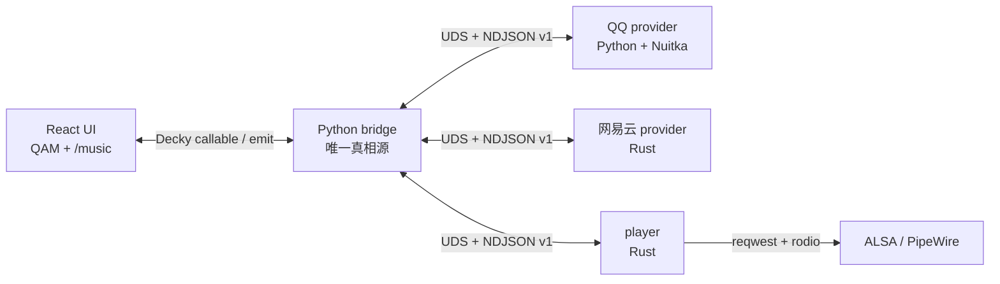

# Decky Music

<p align="center">
  
</p>

<p align="center">
  <strong>在 Steam Deck 游戏模式中享受 QQ 音乐与网易云音乐。</strong>
</p>

<p align="center">
  <a href="https://github.com/jinzhongjia/decky-music/releases">Releases</a> ·
  <a href="docs/DESIGN.md">架构设计</a> ·
  <a href="docs/ROADMAP.md">开发路线图</a> ·
  <a href="docs/ui-design/README.md">UI 设计与完整实机截图</a>
</p>

Decky Music 是为 Steam Deck 游戏模式设计的 Decky Loader 音乐插件。前端采用手柄优先的大屏
界面；音乐服务访问、播放队列和音频输出运行在独立进程中，避免网络请求、解码或后端异常阻塞
Steam UI。

> 当前版本为 **1.0.0-beta.2**。这是预发布软件，安装前请阅读下方限制与说明。

## 实机界面

| QQ 音乐 | 网易云音乐 |
| :---: | :---: |
|  |  |

## 功能特性

在原有双平台、扫码登录、个性化推荐、我的音乐和沉浸播放基础上，当前实现补齐了分类搜索、
内容详情、播放队列、电台与完整手柄交互。

### 双平台内容

| 功能 | QQ 音乐 | 网易云音乐 |
| :--- | :--- | :--- |
| 扫码登录 | 手机 QQ 或微信扫码 | 网易云音乐 APP 扫码 |
| 推荐与发现 | 推荐歌单、新歌首发、猜你喜欢、雷达推荐、榜单 | 每日推荐、推荐歌单、私人 FM、榜单 |
| 搜索 | 热搜；歌曲、歌单、专辑、歌手分类搜索与分页 | 热搜；歌曲、歌单、专辑、歌手分类搜索与分页 |
| 我的音乐 | 喜欢的歌曲、自建歌单、收藏歌单 | 喜欢的歌曲、听歌排行、自建歌单、收藏歌单 |
| 电台 | 猜你喜欢、雷达推荐 | 私人 FM，支持红心与垃圾桶 |
| 播放页 | 同步歌词与翻译 | 逐字歌词、翻译与热评 |

### 播放与 Steam Deck 体验

- **完整播放控制**：后台连续播放、播放队列、上一首/下一首、暂停/继续、进度跳转、音量，
  支持列表循环、单曲循环和随机播放。
- **收藏与队列操作**：红心歌曲、添加到自建歌单，以及手柄 `X` 键上下文菜单。
- **手柄优先**：全程焦点导航，`L1/R1` 顶层切页、`Y` 播放队列、`Start` 全局暂停/继续，
  并由 SteamOS Footer Legend 显示当前按键语义。
- **中英双语**：根据 Steam 客户端语言自动切换中文或英文。
- **故障隔离**：QQ/网易云 provider 与 player 均为独立进程；网络、数据或后端异常在插件内
  降级为错误态，避免拖垮 Steam UI。

## 安装

### 前置条件

- Steam Deck，运行 SteamOS 游戏模式。
- 已安装 [Decky Loader](https://github.com/SteamDeckHomebrew/decky-loader)。
- 安装和首次启动时可访问 GitHub；Decky 会下载并校验 player、QQ provider 和网易云 provider。

### 手动安装预发布版

1. 打开项目的 [Releases](https://github.com/jinzhongjia/decky-music/releases) 页面，选择最新的
   `v1.0.0-beta*` 预发布版本。
2. 复制该版本中 `Decky.Music.zip` 资产的下载链接。不要使用 GitHub 自动生成的
   `Source code` 压缩包。
3. 在 Decky 设置中找到 **Manual Plugin Install**，粘贴 ZIP 下载链接并安装。
4. 安装完成后打开 Decky 快捷菜单中的 **Decky Music**，选择音乐源并进入播放器。

Decky 当前的手动安装器只接受 ZIP 的 URL，详见
[Decky 官方说明](https://wiki.deckbrew.xyz/en/user-guide/settings#manual-plugin-install)。

## 首次使用

1. 在 Decky Music 快捷菜单中选择 **QQ 音乐**或**网易云音乐**。
2. QQ 音乐必须先用手机 QQ/微信扫码登录，免费歌曲也需要有效登录态。
3. 网易云音乐的部分免费歌曲可匿名播放；每日推荐、私人资产、会员音质等功能需要扫码登录。
4. 点击“打开播放器”进入 `/music` 大屏页面。使用 `L1/R1` 切换页面，`A` 选择，`B` 返回，
   `X` 打开上下文操作，`Y` 打开队列，`Start` 暂停或继续播放。

## 已知限制

- 歌曲是否可播取决于账号权益、版权、地区和服务端状态；项目不提供代理或地区绕过能力。
- 切换 QQ 音乐与网易云音乐会停止播放并清空当前队列，因为两端的歌曲 ID 不兼容。
- 电台内容不会跨会话持久化；普通队列会恢复，但插件重启后不会自动开始播放。
- 当前为 beta 版本，主要面向 Steam Deck/SteamOS `x86_64` 游戏模式。
- 当前未提供搜索建议、最近播放历史、跨平台音源兜底或音质偏好设置。

## 架构


```mermaid
graph LR
  UI[React UI<br/>QAM + /music] <-->|Decky callable / emit| BR[Python bridge<br/>唯一真相源]
  BR <-->|UDS + NDJSON v1| QQ[QQ provider<br/>Python + Nuitka]
  BR <-->|UDS + NDJSON v1| NCM[网易云 provider<br/>Rust]
  BR <-->|UDS + NDJSON v1| PLAYER[player<br/>Rust]
  PLAYER -->|reqwest + rodio| AUDIO[ALSA / PipeWire]
```

- UI 只通过 `src/api.ts` 与 bridge 通信，不接触播放 URL 或音频流。
- `main.py` 是 Decky callable 门面；`py_modules/bridge.py` 管理状态、持久化、事件和子进程。
- 同一时间只运行一个 provider；player 独立常驻，直接拉流、解码并输出到系统音频栈。
- bridge 运行在 Decky 冻结的 CPython 中，因此只使用 Python 标准库。
- bridge 与子进程使用 Unix domain socket 和 NDJSON 协议 v1，不开放本地 TCP 端口。
- 三个外部程序通过 Decky `remote_binary` 下载，并由 `package.json` 中的 SHA-256 校验。

更完整的约束、协议和技术选型见 [`docs/DESIGN.md`](docs/DESIGN.md)。

## 本地开发

### 环境

- Node.js 与 `pnpm 11.3.0`
- Python 3.11+ 与 [uv](https://docs.astral.sh/uv/)（QQ provider 开发）
- Rust toolchain（本地检查）
- Docker（构建 SteamOS 兼容的 Rust/QQ provider 发布产物）
- 可通过 SSH 访问的 Steam Deck（真机部署与验收）

### 安装前端依赖

```bash
git clone https://github.com/jinzhongjia/decky-music.git
cd decky-music
pnpm install
pnpm build
```

### 常用命令

| 命令 | 用途 |
| :--- | :--- |
| `pnpm watch` | 监听并构建前端 |
| `pnpm build` | 构建前端到 `dist/` |
| `pnpm test:ui` | 运行前端 Node 测试 |
| `pnpm lint` | TypeScript 类型检查与 Prettier 校验 |
| `python3 -m unittest discover -s tests` | 运行 bridge/protocol Python 测试 |
| `cargo test --workspace` | 运行 Rust workspace 测试 |
| `cargo fmt --all && cargo clippy --workspace` | Rust 格式与静态检查 |
| `(cd qq-provider && uv run ruff check .)` | QQ provider 静态检查 |

### 构建 SteamOS 二进制

发布和真机部署使用 Docker 内的兼容工具链，避免本机 glibc 版本高于 SteamOS：

```bash
bash scripts/build-rust.sh -p player
bash scripts/build-rust.sh -p ncm-provider
bash scripts/build-qq-provider.sh
```

产物分别位于 `target/release/` 和 `qq-provider/build/qq-provider.tar.gz`。

### 部署到开发机

```bash
DECK_HOST=deck@<steam-deck-ip> bash scripts/deploy.sh
```

`scripts/deploy.sh` 会构建前端、打包插件、复制已有二进制并重启 `plugin_loader`。它**不会重新构建**
player/provider；修改 `player/`、`ncm-provider/` 或 `qq-provider/` 后，必须先运行上面的对应构建命令。

## 目录

| 路径 | 职责 |
| :--- | :--- |
| `src/` | React UI、播放器页面、provider 页面和唯一前端 API 层 |
| `main.py` | Decky `Plugin` facade，逐个转发 callable |
| `py_modules/` | bridge、播放队列、协议和日志实现，只使用 Python 标准库 |
| `player/` | Rust 音频 player，负责流式拉取、解码、播放和控制 |
| `ncm-provider/` | 基于 `ncm-api-rs` 的网易云音乐 Rust provider |
| `qq-provider/` | 基于 `QQMusicApi`、由 Nuitka 打包的 QQ 音乐 provider |
| `tests/` | bridge、协议、设置和前端行为测试 |
| `docs/` | 架构、路线图、队列语义、provider 能力和 UI 规格 |
| `scripts/` | SteamOS 兼容构建、真机部署和 CDP 调试工具 |

## 设计与开发文档

- [总体架构与协议](docs/DESIGN.md)
- [功能路线图与当前实现](docs/ROADMAP.md)
- [播放队列语义](docs/QUEUE-BEHAVIOR.md)
- [Provider API 能力对照](docs/PROVIDER-APIS.md)
- [Steam Deck UI 规格与实机截图](docs/ui-design/README.md)
- [Steam 菜单注入调研](docs/STEAM-MENU-INJECT.md)

## 贡献

提交改动前请先阅读 [`AGENTS.md`](AGENTS.md) 和相关设计文档。关键约束：

- callable/emit 契约变化必须同步修改 bridge 与 `src/api.ts`。
- bridge ↔ 子进程协议变化必须同步修改四端 protocol 模块和配套测试。
- 所有用户文案同时维护中文和英文；所有可交互 UI 必须支持手柄焦点导航。
- 日志不得包含播放 URL、Cookie、凭证或其他敏感信息。
- 影响 UI 视觉、文案、布局或焦点的改动必须更新对应 provider 的真机截图。
- Commit 使用 Conventional Commits，主题优先使用中文。

## 致谢

- [Decky Loader](https://github.com/SteamDeckHomebrew/decky-loader)
- [QQMusicApi](https://github.com/L-1124/QQMusicApi)
- [ncm-api-rs](https://github.com/SPlayer-Dev/ncm-api-rs)
- [rodio](https://github.com/RustAudio/rodio) 与
  [reqwest](https://github.com/seanmonstar/reqwest)

## 声明

Decky Music 是非官方项目，与腾讯、网易、QQ 音乐、网易云音乐或 Decky Loader 官方均无隶属关系。
相关名称、商标和内容版权归各自权利人所有。请仅在合法授权范围内使用本项目，并遵守对应服务条款。

## 许可证

本项目基于 [MIT License](LICENSE) 开源。
