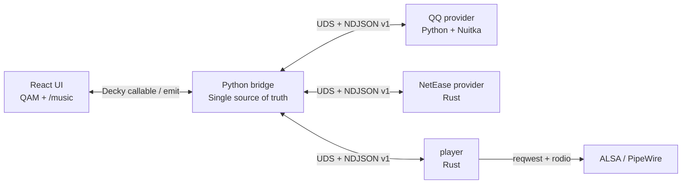

# Decky Music

<p align="center">
  <a href="README.md">简体中文</a> · <strong>English</strong>
</p>

<p align="center">
  
</p>

<p align="center">
  <strong>Enjoy QQ Music and NetEase Cloud Music in Steam Deck Gaming Mode.</strong>
</p>

<p align="center">
  <a href="https://github.com/jinzhongjia/decky-music/releases">Releases</a> ·
  <a href="docs/DESIGN.md">Architecture</a> ·
  <a href="docs/ROADMAP.md">Roadmap</a> ·
  <a href="docs/ui-design/README.md">UI Design and Device Screenshots</a>
</p>

Decky Music is a Decky Loader music plugin designed for Steam Deck Gaming Mode. It provides a
controller-first full-screen UI, while music service access, queue management, and audio output run
in separate processes so network requests, decoding, or backend failures do not block the Steam UI.

> The current version is **1.0.0-beta.2**. This is pre-release software; read the limitations below
> before installing it.

## Device Screenshots

| QQ Music | NetEase Cloud Music |
| :---: | :---: |
|  |  |

## Features

Building on dual-provider playback, QR-code login, personalized recommendations, personal libraries,
and immersive playback, the current implementation adds categorized search, content detail pages,
queue management, radio modes, and complete controller navigation.

### Provider Features

| Feature | QQ Music | NetEase Cloud Music |
| :--- | :--- | :--- |
| QR-code login | Scan with Mobile QQ or WeChat | Scan with the NetEase Cloud Music app |
| Recommendations | Recommended playlists, new releases, Guess You Like, Radar, and charts | Daily recommendations, recommended playlists, Private FM, and charts |
| Search | Hot searches; paginated song, playlist, album, and artist results | Hot searches; paginated song, playlist, album, and artist results |
| My Music | Liked songs, created playlists, and followed playlists | Liked songs, listening ranking, created playlists, and followed playlists |
| Radio | Guess You Like and Radar | Private FM with like and discard actions |
| Now Playing | Synchronized lyrics and translations | Word-by-word lyrics, translations, and popular comments |

### Playback and Steam Deck Experience

- **Complete playback controls:** background continuous playback, queue management, previous/next,
  pause/resume, seeking, volume, list loop, single-track loop, and shuffle.
- **Favorites and queue actions:** like songs, add songs to created playlists, and open contextual
  actions with the controller `X` button.
- **Controller-first navigation:** complete focus navigation, `L1/R1` top-level tabs, `Y` for the
  queue, and `Start` for global pause/resume. SteamOS Footer Legend shows the current button actions.
- **Chinese and English UI:** automatically follows the Steam client language.
- **Failure isolation:** the QQ/NetEase providers and player are separate processes. Network, data,
  or backend failures degrade to an in-plugin error state instead of taking down the Steam UI.

## Installation

### Requirements

- A Steam Deck running SteamOS Gaming Mode.
- [Decky Loader](https://github.com/SteamDeckHomebrew/decky-loader) installed.
- Access to GitHub during installation and first launch. Decky downloads and verifies the player,
  QQ provider, and NetEase provider binaries.

### Install the Pre-release Manually

1. Open the project's [Releases](https://github.com/jinzhongjia/decky-music/releases) page and select
   the latest `v1.0.0-beta*` pre-release.
2. Copy the download URL of the `Decky.Music.zip` asset. Do not use GitHub's automatically generated
   `Source code` archives.
3. Open **Manual Plugin Install** in Decky settings, paste the ZIP URL, and install it.
4. Open **Decky Music** from the Decky Quick Access Menu, select a provider, and enter the player.

Decky's manual installer currently accepts only a ZIP URL. See the
[official Decky documentation](https://wiki.deckbrew.xyz/en/user-guide/settings#manual-plugin-install).

## First Use

1. Select **QQ Music** or **NetEase Cloud Music** from the Decky Music Quick Access Menu.
2. QQ Music requires QR-code login through Mobile QQ or WeChat, including for free tracks.
3. Some free NetEase Cloud Music tracks play anonymously. Daily recommendations, personal assets,
   and membership quality tiers require QR-code login.
4. Select **Open Player** to enter the `/music` full-screen page. Use `L1/R1` to switch pages, `A` to
   select, `B` to go back, `X` for contextual actions, `Y` for the queue, and `Start` to pause or
   resume playback.

## Known Limitations

- Track availability depends on account rights, copyright, region, and service status. The project
  does not provide proxies or region bypasses.
- Switching between QQ Music and NetEase Cloud Music stops playback and clears the queue because
  their track IDs are incompatible.
- Radio content is not persisted across sessions. A normal queue is restored, but playback does not
  start automatically after a plugin restart.
- This beta primarily targets Steam Deck/SteamOS `x86_64` Gaming Mode.
- Search suggestions, recent-play history, cross-provider fallback, and preferred quality settings
  are not currently available.

## Architecture



- The UI communicates only with the bridge through `src/api.ts`; it never receives playback URLs or
  audio streams.
- `main.py` is the Decky callable facade. `py_modules/bridge.py` manages state, persistence, events,
  and child processes.
- Only one provider runs at a time. The player stays in its own process and directly streams,
  decodes, and outputs audio through the system audio stack.
- The bridge runs inside Decky's frozen CPython runtime, so it uses only the Python standard library.
- The bridge and child processes use Unix domain sockets and NDJSON protocol v1 without opening a
  local TCP port.
- Decky downloads the three external programs through `remote_binary` and verifies them with the
  SHA-256 hashes in `package.json`.

See [`docs/DESIGN.md`](docs/DESIGN.md) for the full constraints, protocol, and technology decisions.

## Local Development

### Environment

- Node.js and `pnpm 11.3.0`
- Python 3.11+ and [uv](https://docs.astral.sh/uv/) for QQ provider development
- A Rust toolchain for local checks
- Docker for building SteamOS-compatible Rust and QQ provider release artifacts
- A Steam Deck reachable over SSH for device deployment and verification

### Install Frontend Dependencies

```bash
git clone https://github.com/jinzhongjia/decky-music.git
cd decky-music
pnpm install
pnpm build
```

### Common Commands

| Command | Purpose |
| :--- | :--- |
| `pnpm watch` | Watch and rebuild the frontend |
| `pnpm build` | Build the frontend into `dist/` |
| `pnpm test:ui` | Run the frontend Node tests |
| `pnpm lint` | Run TypeScript checks and Prettier validation |
| `python3 -m unittest discover -s tests` | Run bridge/protocol Python tests |
| `cargo test --workspace` | Run Rust workspace tests |
| `cargo fmt --all && cargo clippy --workspace` | Run Rust formatting and static checks |
| `(cd qq-provider && uv run ruff check .)` | Run QQ provider static checks |

### Build SteamOS Binaries

Release and device deployment use compatible toolchains inside Docker to avoid building against a
newer glibc than SteamOS:

```bash
bash scripts/build-rust.sh -p player
bash scripts/build-rust.sh -p ncm-provider
bash scripts/build-qq-provider.sh
```

Artifacts are written to `target/release/` and `qq-provider/build/qq-provider.tar.gz`.

### Deploy to a Development Deck

```bash
DECK_HOST=deck@<steam-deck-ip> bash scripts/deploy.sh
```

`scripts/deploy.sh` builds the frontend, packages the plugin, copies existing binaries, and restarts
`plugin_loader`. It **does not rebuild** the player or providers. After changing `player/`,
`ncm-provider/`, or `qq-provider/`, run the corresponding build command above before deploying.

## Project Structure

| Path | Responsibility |
| :--- | :--- |
| `src/` | React UI, player screens, provider screens, and the only frontend API layer |
| `main.py` | Decky `Plugin` facade that forwards callables one by one |
| `py_modules/` | Standard-library-only bridge, playback queue, protocol, and logging code |
| `player/` | Rust audio player for streaming, decoding, playback, and controls |
| `ncm-provider/` | Rust NetEase Cloud Music provider built on `ncm-api-rs` |
| `qq-provider/` | QQ Music provider built on `QQMusicApi` and packaged with Nuitka |
| `tests/` | Bridge, protocol, settings, and frontend behavior tests |
| `docs/` | Architecture, roadmap, queue semantics, provider capabilities, and UI specifications |
| `scripts/` | SteamOS-compatible builds, device deployment, and CDP debugging tools |

## Design and Development Documentation

- [Architecture and protocol](docs/DESIGN.md)
- [Feature roadmap and current implementation](docs/ROADMAP.md)
- [Playback queue semantics](docs/QUEUE-BEHAVIOR.md)
- [Provider API capability matrix](docs/PROVIDER-APIS.md)
- [Steam Deck UI specifications and device screenshots](docs/ui-design/README.md)
- [Steam menu injection research](docs/STEAM-MENU-INJECT.md)

## Contributing

Read [`AGENTS.md`](AGENTS.md) and the relevant design documents before submitting changes. Key
constraints:

- Changes to the callable/emit contract must update both the bridge and `src/api.ts`.
- Changes to the bridge-to-child protocol must update all four protocol modules and their tests.
- Maintain all user-facing copy in both Chinese and English, and keep every interactive UI reachable
  through controller focus navigation.
- Never include playback URLs, cookies, credentials, or other sensitive data in logs.
- Changes that affect UI visuals, copy, layout, or focus must update the corresponding provider's
  device screenshots.
- Use Conventional Commits; subjects should preferably be written in Chinese.

## Acknowledgments

- [Decky Loader](https://github.com/SteamDeckHomebrew/decky-loader)
- [QQMusicApi](https://github.com/L-1124/QQMusicApi)
- [ncm-api-rs](https://github.com/SPlayer-Dev/ncm-api-rs)
- [rodio](https://github.com/RustAudio/rodio) and
  [reqwest](https://github.com/seanmonstar/reqwest)

## Disclaimer

Decky Music is an unofficial project and is not affiliated with Tencent, NetEase, QQ Music,
NetEase Cloud Music, or the Decky Loader project. All related names, trademarks, and content rights
belong to their respective owners. Use this project only where legally authorized and follow the
applicable service terms.

## License

This project is licensed under the [MIT License](LICENSE).
