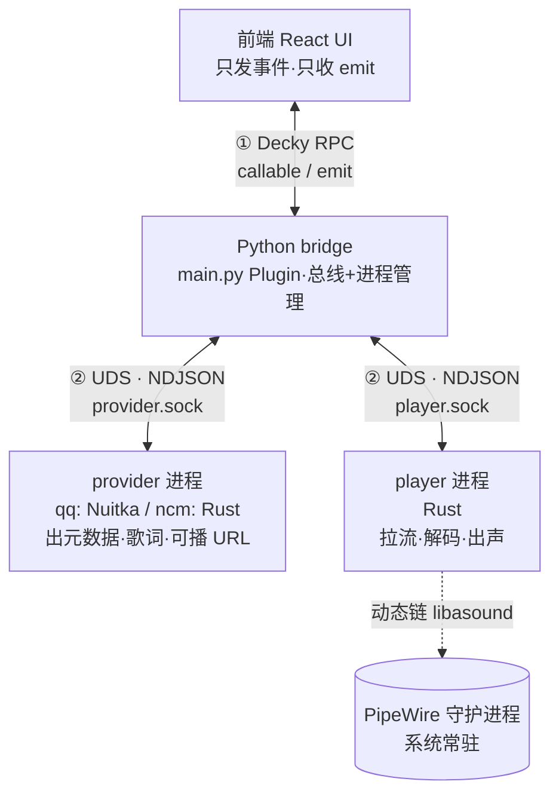
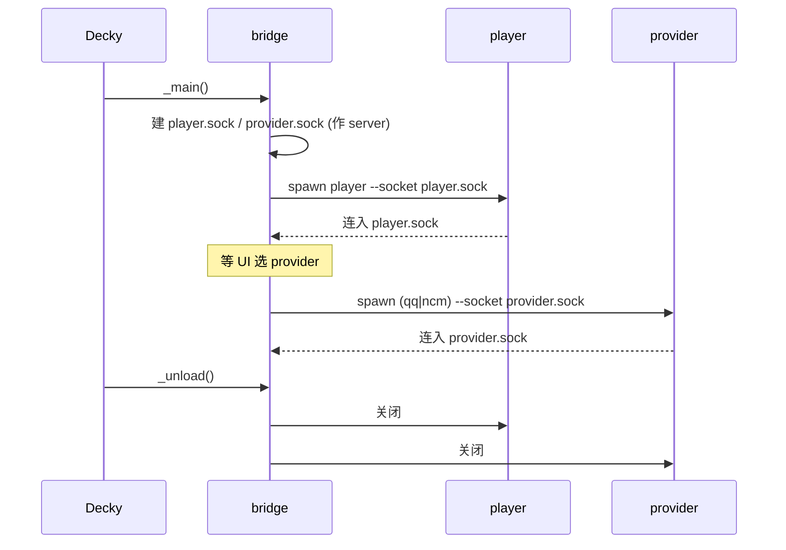
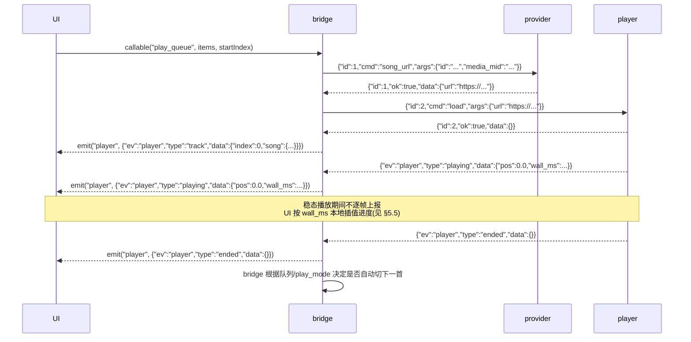
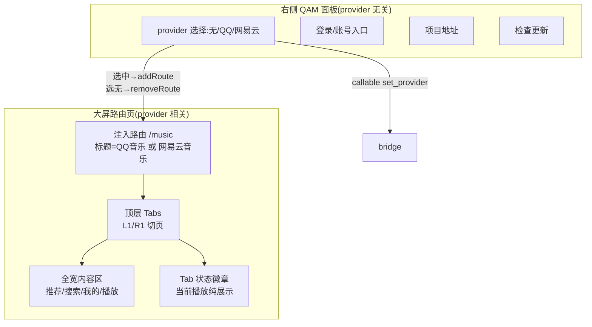
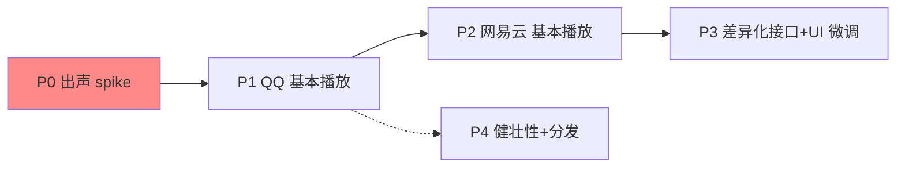

# Steam Deck 音乐插件设计方案

> 目标:为 Steam Deck 的 Decky Loader 写一个插件,集成 **QQ 音乐** 与 **网易云音乐** 的播放支持。
> 核心思想:**插件本体只做 UI + 通信桥,真正的业务逻辑与音频播放作为独立进程运行在 Decky 沙盒之外**,以换取稳定性与不受 Decky 构建环境约束。

---

## 1. 背景与约束来源

Decky 插件的后端**不是**独立进程,而是被 loader 用 `multiprocessing.Process` fork 出来的子进程:

- 执行时复用 **Decky 自己 PyInstaller 打包的冻结 Python 解释器**(`backend/pyinstaller.spec`),不是系统 Python,也不是插件自带的 venv。
- 启动即 `setuid/setgid` 降权到 `deck` 用户(`backend/decky_loader/plugin/sandboxed_plugin.py:65-66`),除非 `plugin.json` 的 `flags` 含 `root`。
- 只能通过 `sys.path.append(.../py_modules)` 加载**纯 Python** 模块(`sandboxed_plugin.py:84`)。

**推论:任何带编译扩展的库都不能直接进插件后端。**
QQMusicApi 依赖 `cryptography` / `orjson` / `niquests[speedups]` / `pydantic`(Rust core)/ `paho-mqtt`,全是需精确匹配 CPython ABI + glibc 的编译 wheel —— 塞进冻结解释器必然随 Decky 版本升级而崩。这正是"受 Decky 构建环境约束 + 容易崩溃"的根因。

**结论:业务后端必须脱离插件进程,以独立二进制运行。** 一旦 bridge `subprocess` 拉起外部二进制,该进程即带自己的运行时、脱离冻结解释器 —— 稳定性与"脱沙盒"由此达成,与二进制内部是一个还是多个无关。

---

## 2. 总体架构

三类角色、多进程,UI 的所有流量强制经过 bridge:



设计红线(用户明确要求):

1. **UI 只跟 bridge 说话**,不知道 provider/player 存在,不直接碰后端。
2. **不走 TCP,全部 unix domain socket。**
3. player 是**独立进程**,与 provider 分离,崩溃互不影响。

---

## 3. 组件职责

| 组件 | 语言/形态 | 职责 | 明确不做 |
|---|---|---|---|
| **UI** | React (TS) | 发控制事件、收状态推送、渲染 | 不碰音频流、不碰 URL、不直连后端 |
| **bridge** | Python (`main.py` Plugin 类) | 总线:收 UI 命令→转发子进程→回 emit;spawn/监督/重启两个子进程 | 不含任何音乐业务逻辑 |
| **provider** | qq: Python+Nuitka / ncm: Rust | 搜索、歌单、歌词、**解析可播 URL** | 不播放音频 |
| **player** | Rust | 拿 URL:HTTP 拉流、解码、seek、音量、推 PipeWire;上报进度/结束 | 不查询音乐 API |

职责分离的意义:provider 崩了不影响正在播放的 player;player 崩了不影响查询;bridge 负责把崩掉的子进程重新拉起。

---

## 4. 进程模型与生命周期

- **player**:常驻。bridge `_main()` 时即 spawn。
- **provider**:按 UI 选择的 provider 唤起(`qq` / `ncm`)。切换 provider 时先停旧进程再起新进程,同一时刻只有一个 provider 存活；同时清空当前队列并停止播放,因为 QQ/NCM Song ID 体系不兼容。
- **socket 拓扑**:**bridge 作 server,子进程启动后主动连入**。socket 文件放 `DECKY_PLUGIN_RUNTIME_DIR`(bridge 有写权)。好处:socket 由 bridge 先建好,崩溃重连逻辑集中在 bridge 侧。
- **卸载**:Decky 卸载插件时调 `_unload()`,bridge 关闭两个子进程与 socket。
- **状态归属:bridge 是唯一真相源。** 跨会话/跨 provider 的状态——provider 选择、音量、播放模式、**播放队列 + "放完切下一首"决策**、cookie/账号——全归 bridge 持有(它唯一常驻、不被替换、收得到 player 的 `ended` 事件)。**队列决策绝不放 UI**:否则用户退出播放页去打游戏、UI 卸载 → 当前歌放完就停,不续播。player 只放音、provider 只查询(无状态)、UI 只显示。
- **持久化:bridge 落盘,单一来源。** 上述状态由 bridge 存 `DECKY_PLUGIN_SETTINGS_DIR`,启动读回恢复。UI 通过 `callable` 读写、自己不落盘(Steam CEF 不能直接写文件);provider 保持无状态,cookie 由 bridge 在 spawn 时注入,provider 不自存 → 空闲退出/切换都不丢账号。
- **持久化格式:单文件 `settings.json`(stdlib `json`)。** 被 §5.5 约束锁定——冻结解释器只能用 stdlib,`json` 又是全项目通用语,不引第二套序列化。stdlib 其余淘汰:`tomllib` 只读无写入器、`configparser` 表达不了队列 list、`sqlite3` 对小 config 过重(留作未来存大量历史/缓存的升级路径)。四个必带细节:
  - **原子写**:写临时文件 → `os.replace()` 换名。bridge 可能被 kill,半截写会损坏配置。
  - **schema 版本字段** `{"version":1,...}`:将来改结构可迁移。
  - **不存可再生数据**:绝不持久化解析出的歌曲 URL(限时签名会过期,§13.2)。普通队列只存 `songId + 队列索引`,恢复时重新解析；电台流不持久化推荐批次,只存 `queue_mode + radio_type`,用户确认后重拉。
  - **cookie 私有**:文件 `chmod 0600`(deck 用户私有,非世界可读)。
  结构示意:`{"version":1,"provider":"qq","volume":0.8,"play_mode":"list_loop","queue_mode":"normal","queue":{"ids":[...],"index":3},"radio_type":null,"accounts":{"qq":"<cookie>","ncm":"<cookie>"}}`



---

## 5. 通信设计

### 5.1 UI ↔ bridge:Decky RPC

Decky 只提供两种原语,足够:

- **`callable(route)`** — 前端 → bridge 的 RPC(底层 websocket,`frontend/src/wsrouter.ts:193`)。前端 `@decky/api` 的 `callable("method")` 直接调用 bridge `Plugin` 类的同名 async 方法。
- **`emit` / `addEventListener`** — bridge → 前端主动推送(`backend/decky_loader/plugin/imports/decky.py` 的 `emit`)。

### 5.2 bridge ↔ 子进程:UDS + NDJSON + 协议 v1

传输帧仍然**照抄 Decky 自己的内部传输**(`backend/decky_loader/localplatform/localsocket.py`):

- **换行分隔 JSON(NDJSON)**:每条消息一行 `{json}\n`,UTF-8。
- 单条上限 **1 MiB**(与 Decky `BUFFER_LIMIT = 2**20` 对齐)。

协议当前只保留 **v1**。四种消息:

| 方向 | 类型 | 形状 |
|---|---|---|
| bridge → child | Request | `{"id":N,"cmd":C,"args":{...}}` |
| child → bridge | Response ok | `{"id":N,"ok":true,"data":{...}}` |
| child → bridge | Response error | `{"id":N,"ok":false,"error":{"code":"...","message":"..."}}` |
| child → bridge | Domain Event | `{"ev":"player"|"login"|"provider","type":T,"data":{...}}` |
| child → bridge | Log Event | `{"ev":"log","level":"debug|info|warn|error","where":"...","msg":"..."}` |

实现约束:

- 构造 / 解码集中在协议模块:bridge `py_modules/protocol.py`,QQ `qq-provider/protocol.py`,NCM `ncm-provider/src/protocol.rs`,player `player/src/protocol.rs`。
- request id 由 bridge 递增生成。每条 `Conn` 支持多请求在途,bridge 用 `id -> Future` demux 响应并丢弃超时后的迟到响应;写 socket 只锁单帧原子性。provider/player 写回仍经单一 out queue 串行写帧。
- 失败响应必须带稳定 `error.code`,前端 `src/api.ts` 本地化;`message` 只作安全 fallback。
- 子进程诊断走 `Log Event`;stderr 只留 panic/traceback 等非预期输出。

> 关于 provider 包裹:ncm-api-rs 与 QQMusicApi **都作为库使用**,由我们各写一层 wrapper 暴露上述 NDJSON-over-UDS 协议(不用它们自带的 axum / FastAPI HTTP server)。两个 provider 因此协议一致,bridge 统一对待。

### 5.3 一次"播放"的完整流转(协议 v1)



UI 全程拿不到 URL、碰不到音频流,一切经 bridge。

### 5.4 为什么 UDS 而非 TCP(附带收益)

- 无端口占用问题:Decky 自身用 1337/8080(README「Common Issues」),UDS 完全绕开端口冲突。
- 本机进程间通信,天然不暴露网络监听面。
- 与 Decky 自身传输范式一致。

### 5.5 编码格式与"打游戏时播放"的性能设计

**前提:音频 PCM 不经过 bridge。** player 直接拉流、直接推 PipeWire(§5.3),bridge 只承载**控制面**——控制命令 + 状态事件。因此"高性能"的着力点不在序列化格式,而在**减少 CPU 唤醒与抖动**(游戏正在抢 CPU/GPU)。

实际流量(全是小消息、低频):

| 链路 | 消息 | 频率 | 大小 |
|---|---|---|---|
| UI→bridge | play/pause/seek/volume/选 provider | 人手触发,几次/分钟 | ~30B |
| bridge→provider | song_url/搜索/歌词 | 人手触发 | 请求 ~30B,搜索结果 5-50KB |
| player→bridge | playing/ended/error 事件 | 状态变化时 | ~30B |

`{"ev":"player","type":"playing","data":{"pos":42,"wall_ms":...}}` 也只是百字节级,stdlib `json.loads` 解它约 **1-3 微秒**;50KB 搜索结果约 0.5-1ms 且每次人手搜索才发生一次。**这点量 JSON 绰绰有余,序列化不是瓶颈。**

**编码决策(逐跳):**

| 链路 | 编码 | 库 | 理由 |
|---|---|---|---|
| UI ↔ bridge | JSON | Decky 底层已定 | `callable`/`emit` 走 websocket JSON,无选择权 |
| bridge ↔ 子进程 | NDJSON | **Python: stdlib `json`** | **硬约束**:bridge 跑在冻结解释器,`orjson`/`msgpack`/`protobuf` 皆编译扩展,不能可靠加载(同 §1 的 C 扩展坑)。bridge 必须零第三方依赖 |
| 子进程侧 | NDJSON | Rust: `serde_json`;qq: stdlib `json` | serde_json 随 ncm-api-rs 进来,纯 Rust 静态无碍;qq 的 Nuitka 自带运行时不受约束但无必要上 orjson |

**性能真正的着力点(与序列化无关):**

1. **进度本地插值(最大一笔)。** player 只在**状态变化时**发一次 `{"ev":"playing","pos":42.0,"wall_ms":<epoch>}`;UI 本地用 `pos + (now - wall_ms)` 自己算进度、靠 `requestAnimationFrame` 刷新。**稳态播放期间控制面 IPC 趋近于零。** 只在 play/pause/seek/ended 时重新同步。→ 把进度流量从 N Hz 砍到 ~0,这才是省 CPU 的关键。
   > YAGNI:低频 resync(定时纠偏)先不做——插值在无缓冲卡顿时精确;等真观测到漂移再加。
2. **全链路 event-driven,禁止轮询忙等。** bridge 阻塞在 `asyncio` `readline` 上,无消息即睡。
3. **解码效率交给 rodio/symphonia**(原生码,压缩流解码 ~1-2% 单核),已由 §7.3 解决。

**何时才换二进制格式(YAGNI 闸门):** 仅当 profiling 实测 JSON 成为瓶颈——对纯控制面流量不会发生。现在上 msgpack/protobuf 是纯负债:bridge 侧还用不了(编译扩展),白白牺牲可调试性。

---

## 6. 前端 UI 设计

UI 分两个面,**职责严格分离**:右侧 QAM 面板做全局控制(provider 选择、登录入口、设置),大屏路由页做 provider 内容浏览。全部基于 Decky/Steam 的 `@decky/ui` 原语构建。两条硬约束,优先级明确:**① 绝不拖垮宿主 Steam UI(首要,§6.5);② 手柄可导航(Steam Deck 无鼠标,§6.4)。**

> P3 大屏 UI 规格已整理到 `docs/ui-design/`:共享 Steam Deck 视觉/手柄规则、QQ/NCM 页面规格、API 缺口与本地渲染图索引。最新设计采用 SteamOS 官方库范式:**顶层横向 Tabs + 全宽内容区 + Tab 状态徽章**,不再使用常驻左侧栏或底部固定 MiniPlayer。设计图 PNG 位于 `docs/ui-design/assets/`,通过 Git LFS 管理。

### 6.1 两个 UI 面概览



### 6.2 右侧 QAM 面板(provider 无关)

插件在 Decky QAM tab 的默认内容,用 `PanelSection` / `PanelSectionRow` 承载。**只做全局控制,不含任何音乐业务**:

| 元素 | 组件 | 行为 |
|---|---|---|
| provider 选择 | `Dropdown`(选项:无 / QQ音乐 / 网易云音乐) | 改选 → `callable("set_provider")` + 条件注入/移除大屏路由(§6.3) |
| 登录/账号入口 | `ButtonItem` / 状态行 | 跳转扫码登录或账号设置;credential 仍由 bridge 持久化 |
| 项目地址 | `ButtonItem` → `Navigation.NavigateToExternalWeb(url)` | 打开 GitHub(实证 `ExternalLink.tsx`) |
| 检查更新 | `ButtonItem` → `callable("check_update")` | 走 Decky 插件更新流(§8 分发) |

> **"无 provider"是合法初始态**:未选 provider 时**不注入**大屏路由(§6.3),QAM 只显示介绍/地址/更新。这是设计红线——路由存在性由 provider 选择驱动。

### 6.3 大屏路由页(provider 相关,条件注入)

**注入机制(实证 API):**

- 选中 provider → `routerHook.addRoute('/music', <ProviderPage/>)`(实证 `plugin-loader.tsx:129`);路由标题随 provider 显示 **"QQ音乐"** 或 **"网易云音乐"**。
- 选"无" → `routerHook.removeRoute('/music')`,大屏入口消失。
- 进入:`Navigation.Navigate('/music')` + `Navigation.CloseSideMenus()`(实证 `TitleView.tsx:21-27`)。触发点为 QAM 内一个"打开播放器"按钮或已验证的左侧菜单注入路径。
- 路由 patch 进 **gamepad 路由**(`EUIMode.GamePad`,实证 `router-hook.tsx:81-83`)= Steam Deck 大屏全屏页。

**SteamOS 官方范式:**

- **顶栏分层**:右上角搜索/通知/Wi-Fi/电量/时间/头像是 SteamOS 全局 chrome,插件不绘制、不聚焦、不修改。插件 Logo 与 provider Tabs 放在内容区首行。
- **顶层横向 Tabs**:`L1/R1` 切 provider 页面。QQ:推荐/搜索/我的音乐/智能电台/正在播放;NCM:发现/私人FM/搜索/我的/正在播放。
- **全宽内容区**:个人资产页采用官方库范式(二级 Tab 行 + 全宽列表/网格),不使用常驻左侧栏。
- **去常驻播放条**:SteamOS 软键盘会压缩 CEF 视口,底部固定 MiniPlayer 会被顶起并挤压搜索结果。P3 目标改用 Tab 状态徽章(纯展示)、`Start` 全局播放/暂停、`Y` 队列浮层、沉浸播放页承载完整控制。
- **Footer Legend**:插件只通过 `Focusable` 的 `actionDescriptionMap` / `onOKActionDescription` 声明文案;白圈图标、位置、左侧 `STEAM` 菜单由系统渲染。

**封面图处理(P3 大屏 UI 才出现):**

封面是二进制大块(每张几十 KB),**绝不走 bridge 的 NDJSON/callable 控制面**——一屏 50 张 base64 塞进 RPC 是灾难。取图三选一:

| 方案 | 怎么回事 | 取舍 |
|---|---|---|
| **A 直连 CDN(选它)** | provider 只回封面 **URL**;UI ``,浏览器原生 GET + 缓存 + `onError` 兜底 | 最简、图裂不崩溃;代价:静态图绕过 bridge |
| B decky `/fetch` 代理 | 走 Decky 自带 `/fetch`(§5.1) | 不直连但要处理 auth token |
| C 后端下载缓存 | provider/bridge 下到 `DECKY_PLUGIN_RUNTIME_DIR`,UI 读本地 | 最合红线但最重;Steam CEF 加载 `file://` 权限待验证 |

> **红线精确化**:"UI 所有消息经 bridge"的**本意是音乐控制/数据/音频不泄漏、可隔离**。封面是**静态展示资源**,非业务数据;`` 拉图失败只图裂(`onError` 占位),**不威胁 §6.5 崩溃隔离**。故封面等静态图片**允许浏览器直取 CDN 缩略图**(方案 A),音乐控制/数据/音频仍必经 bridge。

性能动作见 §13.2(缩略图尺寸、虚拟列表只渲染视口内、缓存)。

### 6.4 手柄控制支持(横切所有 UI,硬约束)

Steam Deck 无鼠标,**每个可交互元素必须可被手柄焦点树导航**,否则不可用:

- **一切可交互元素包 `Focusable`**(实证遍布 `@decky/ui`):`onActivate` / `onOKButton`(A)/ `onCancelButton`(B,返回上一层或退出页)/ `onSecondaryButton`(X/Y)。
- **焦点走位**:方向键遍历焦点树;网格/横向布局用 `NavEntryPositionPreferences.MAINTAIN_X`(实证 `PluginCard.tsx:152`)保持列对齐,避免焦点乱跳。
- **搜索输入**:`TextField` 聚焦即唤起 Steam 手柄软键盘(实证 `Store.tsx` 搜索框),不依赖物理键盘。
- **上下文操作**:长列表项用 `showContextMenu` + `Menu`/`MenuItem`(实证 `plugin_list/index.tsx:63`),而非 hover 菜单。
- **禁止项**:无纯 hover 交互、无纯鼠标点击、无不可聚焦的可点区域;焦点环必须可见。
- 验收并入各 UI 阶段:**纯手柄从 QAM 选 provider → 进大屏 → 搜索 → 选歌 → 播放 → 控制,全程不接鼠标键盘可完成**。

### 6.5 【首要约束】UI 崩溃隔离:绝不拖垮宿主 Steam UI

**风险根源:我们是侵入式插件,前端与 Steam Gamepad UI 跑在同一 Chromium 上下文 / 同一 JS 堆 / 同一主线程(SharedJSContext)。** 后端多进程隔离(§2)救不了前端——前端天生同域。这是压倒一切的第一约束:宁可我们的 UI 自己不可用,也绝不能让 Steam 界面崩溃/冻结。

**Decky 已给的兜底(实证,必要但不充分):**

- 每条注入路由套 `<ErrorBoundary>`(`router-hook.tsx:294`),QAM 内容也套(`PluginView.tsx:41`)。**渲染期/生命周期**抛异常 → 显示 Decky 错误页,Steam 存活,可 `_deckyForceRerender` 恢复(`errorboundary-hook.tsx:104`)。
- 全局错误归因区分插件错误 vs Valve 错误(`getLikelyErrorSourceFromValveError`)。

**React ErrorBoundary 抓不到、必须我们自己防的逃逸路径:**

| # | 逃逸风险 | 后果 | 我们的规避(强制) |
|---|---|---|---|
| 1 | **异步/事件回调抛错**(`callable()` promise、`onClick`、`setTimeout`) | 逃逸边界→全局未处理拒绝 | 每个 `callable`、事件处理、promise **一律 try/catch**;失败落到 UI 内的错误态,不外抛 |
| 2 | **阻塞主线程**(同步死循环/重计算/超大同步解析) | **冻结整个 Steam UI**(单线程) | 前端**零重计算**:解码/拉流/加密全在后端进程(架构红利);UI 只做展示+IPC |
| 3 | **未清理副作用**(定时器、监听器、`addRoute` 未在卸载移除) | 跨插件 reload 在共享上下文累积泄漏 | 组件卸载/`_unload` 时清空所有 timer、`removeEventListener`、`removeRoute` |
| 4 | **篡改宿主**(monkey-patch Steam 内部 / 改全局原型 / 污染全局命名空间) | 破坏宿主状态 | **只用文档化的 `@decky/ui`+`@decky/api`**;绝不 patch Steam 内部,绝不写全局变量 |
| 5 | **无界渲染**(上万搜索结果/歌单节点灌进 Steam DOM) | 卡顿/内存膨胀 | 列表虚拟化/分页;搜索输入 debounce;绝不一次渲染巨量节点 |
| 6 | **IPC 永不返回**(后端 hung/崩溃,`callable` 不 resolve) | UI 永久挂起 | 所有 IPC 带**超时**;超时→graceful 状态,不空转 |
| 7 | **后端数据缺失/畸形**(后端是独立进程,可能崩) | 渲染期解引用 undefined 抛错 | **防御式渲染**:null-check、默认值;缺字段绝不在渲染期抛 |

**纵深防御:自套 ErrorBoundary。** 除 Decky 外层边界,我们在自己两个 UI 面(QAM、大屏页)顶层**各再套一层 `ErrorBoundary`**,子树出错时显示我们自己的降级 UI(“暂时不可用/重试”),连 Decky 兜底都尽量不触发。

**验收(每个含 UI 阶段的硬门槛):** 注入错误、杀死后端进程、灌畸形数据、断网——**Steam UI 始终不崩不冻**,最坏只是我们的面板显示错误态并可恢复。这是比功能更优先的验收项。

---

## 7. 技术选型

### 7.1 网易云 provider — ncm-api-rs(Rust)

选它而非 Node 版 api-enhanced 的理由:

| 维度 | api-enhanced (Node) | **ncm-api-rs (Rust)** |
|---|---|---|
| 运行时 | 需 Node runtime | **纯静态二进制,零运行时** |
| 内存 | ~50-100MB | **~5MB** |
| TLS | — | `rustls-tls`,**不碰系统 OpenSSL**(`Cargo.toml:16`) |
| 接口 | 基准 | 与 Node 版 1:1 |

作为库使用:`create_client(cookie)` + `Query` 链式传参(README 示例:`cloudsearch` / `song_detail` / `lyric` / `song_url_v1`)。我们在其上包一层 UDS server。

### 7.2 QQ 音乐 provider — QQMusicApi(Python)+ Nuitka

- 作为库使用(`qqmusic_api`,异步),我们包一层 UDS server。
- 用 **Nuitka `--standalone`** 打包(目录形态,自带 CPython + C 扩展)。**不用 `--onefile`**:onefile 每次启动都解压到 /tmp,而 provider 会被反复启停(§13 空闲退出),重复解压是纯开销。standalone 目录打包成**一个压缩档**分发(契合 `remote_binary` 单文件模型),**安装时解压一次**,之后启动零解压。
- 形态上不静态,但同样**独立进程、脱沙盒、不吃 Decky 环境约束**。
- 现状不对称是可接受的:QQ 无现成 Rust 库,自行移植加密逻辑成本过高;两个 provider 对 bridge 呈现同一 UDS 协议即可。

### 7.3 player — Rust,rodio + reqwest

> 约束澄清:SteamOS 是完整 Arch-based DE,**核心音频栈(PipeWire + pulse/alsa 兼容层、`libasound`)保证存在**;要防的是**冷门/非常规动态库**缺失。因此放弃"musl 全静态 + 纯 Rust PA 协议"的重方案,走懒路。


- **拉流**:`reqwest`,只开 `rustls-tls`,不碰 OpenSSL。
- **解码+输出**:`rodio`(内置 `symphonia` 解码 + `cpal` 输出),一个 crate 搞定解码/播放/seek/音量。核心逻辑约 30 行。
- **构建目标**:`x86_64-unknown-linux-gnu`(默认)。**不用 musl。**
- **依赖形态**:所有 Rust crate 静态进二进制,**唯一动态依赖是 SteamOS 保证存在的 `libasound.so`** → 经 `pipewire-alsa` 兼容层 → PipeWire,自动走系统混音/音量。

被否方案记录:

- `cpal`/ALSA **静态**链接:`libasound` 靠 `snd_dlopen()` 运行时 dlopen 插件,静态链接崩(`_snd_ctl_hw_open not defined`),`alsa-sys` 干脆 hardwire `static(false)` → 淘汰。
- `libpulse-binding`:链 C `libpulse.so`,非纯 Rust → 约束放开后无必要。
- `pipewire-rs` / `pipewire-native`:前者 C bindings;后者纯 Rust 但**音频处理尚未实现**,不能播 → 淘汰。
- `pulseaudio` crate(纯 Rust PA 协议 over socket):零系统库耦合,但需手搓 PA stream/格式协商/共享内存,代码量大。仅在"必须零耦合 + musl 全静态"时才需要;约束已放开,不选。

### 7.5 桌面/系统媒体集成 — MPRIS2(player 侧)

player 额外托管标准 **MPRIS2** D-Bus 服务(`org.mpris.MediaPlayer2` + `.Player`),让桌面媒体控件、`playerctl`、蓝牙耳机 AVRCP 按键等消费者显示 now-playing 并控制播放。

- **归属:player(Rust)而非 bridge。** bridge 跑在 Decky 冻结解释器只能 stdlib,手写 D-Bus 线协议代价大;player 是 Rust、常驻、且本就持有实时播放态(状态/进度/音量)。用 **`mpris-server`(基于 `zbus`,纯 Rust,直接走 session bus 线协议,不链 C `libdbus`)** —— 维持"ldd 只动态依赖 libasound"。
- **控制回路:MPRIS 是又一个汇入 bridge 的控制面。** 所有控制动作(play/pause/next/prev/seek/volume/loop/shuffle)不在 player 本地执行,而是上送 `{"ev":"player","type":"control","data":{"action",...}}` 事件;bridge 按 UI callable 同一套方法处理(§4 唯一真相源),再把常规命令下发 player + emit UI,MPRIS 与 UI 永不分叉。
- **展示回路:** 状态/进度/音量由 player 自身音频态直接渲染(不往返);曲目元数据经新增 **`meta` 命令**(bridge→player,随切歌下发 title/artist/cover/时长 + 可否上下曲 + 播放模式)。
- **失败降级:** 连不上 session bus(无 D-Bus / 无权限)→ 记 warn 跳过,绝不阻塞出声(呼应 §6.5 崩溃隔离精神)。
- **消费者验证:** Desktop Mode(KDE)开箱可用;Game Mode(gamescope)是否有消费者(如蓝牙 AVRCP 经 mpris-proxy)需按会话实测 —— 服务注册本身与会话无关。

### 7.4 登录与不可用歌曲处理(provider 通用)

- **登录:统一扫码(QR)。** 两 provider 都走二维码登录,不做手机号/密码。bridge 向 provider 要登录二维码 → `emit` 给 UI 在大屏显示 → 用户手机扫 → provider 轮询到 cookie → 回传 bridge → bridge 存 `DECKY_PLUGIN_SETTINGS_DIR`(§4 持久化)。后续 spawn provider 时由 bridge 注入 cookie,provider 无状态。
  - 手柄友好:扫码无需任何文本输入,天然适配无鼠标/键盘环境。cookie 过期 → 报错并提示重新扫码。
  - **修订(2026-07-04):登录是 QQ 基本播放的前置,非 VIP/高音质专属。** 实测 QQ 即使免费歌,song_url(vkey)匿名请求也返 `104003`(无版权/需登录),必须先扫码登录。故登录已提前到 P1 实现(原计划放 P4)。QQ 用 `QRLoginType.QQ`(手机 QQ 扫)。**ncm 相反(2026-07-05 P2 实测):免费歌 `song_url_v1` 匿名即返 `code=200` + 可播 URL,基本播放无需登录**;登录仅为 VIP/高音质。
- **不可用歌曲:直接报告用户,不绕。** 版权下架、VIP-only、区域限制(如 ncm `460 cheating` / `301` 未登录)等——provider 把错误原样上报,UI 显示"这首暂时无法播放(原因)",**不支持配置代理 / real_ip**。海外/受限网络下的可用性不是本项目目标。呼应 §6.5 防御式渲染:错误态是正常分支,不崩不冻。

---

## 8. 分发方案

用 Decky 原生的 **`remote_binary`** 机制(`backend/decky_loader/browser.py:66-96`):在插件 `package.json` 声明二进制的下载 URL + sha256,安装时自动下载到插件 `bin/` 并 chmod。

```json
{
  "remote_binary": [
    { "name": "ncm-provider", "url": "https://.../ncm-provider-linux-x64", "sha256hash": "..." },
    { "name": "qq-provider",  "url": "https://.../qq-provider-linux-x64",  "sha256hash": "..." },
    { "name": "player",       "url": "https://.../player-linux-x64",       "sha256hash": "..." }
  ]
}
```

- 对外分发物是插件包 + 三个从 Release 拉取的二进制,各自带 hash 校验。
- 若坚持"单一文件"分发,可另写 launcher 用 `include_bytes!` 嵌入 —— 但当前不需要,`remote_binary` 数组已够。

---

## 9. 当前实现索引

当前以源码模块作为协议与行为的真相源:

| 文件 | 职责 |
|---|---|
| `main.py` | Decky `Plugin` 门面,只把 callable 转发给 bridge |
| `py_modules/bridge.py` | UDS server、子进程生命周期、provider 切换、credential 注入、UI 事件转发 |
| `py_modules/protocol.py` | bridge 侧协议 v1 request 构造、response/event/log 严格解码 |
| `py_modules/playback.py` | 播放/普通队列真相源、自动切歌、`track`/`player` 事件转发 |
| `src/api.ts` | 前端唯一接口层:callable 声明、事件类型、运行时 guard |
| `qq-provider/protocol.py` | QQ provider 协议 v1 构造/解码 |
| `ncm-provider/src/protocol.rs` | NCM provider 协议 v1 构造/解码 |
| `player/src/protocol.rs` | player 协议 v1 构造/解码 |
| `player/src/mpris.rs` | player 侧 MPRIS2 D-Bus 服务(now-playing 展示 + 控制上送 bridge;zbus 纯 Rust,§7.5) |

跨层改动规则:

1. 改 bridge callable 或 emit 事件 → 同步改 `src/api.ts`。
2. 改 bridge ↔ child 协议字段 → 同步改四端 protocol 模块与测试。
3. 子进程错误必须返回稳定 `error.code`;日志和错误消息不得包含 URL/cookie/credential。

---

## 10. 关键风险与待验证项(按优先级)

1. **【最高】player 在 gamescope 会话下能否出声。**
   - 确认 `rodio` 能开 ALSA 默认设备并路由到 PipeWire。
   - 确认 bridge spawn player(降权 `deck` 用户,uid 1000)时 `XDG_RUNTIME_DIR=/run/user/1000` 等环境变量传对,音频会话能接上。
   - **这是整个播放链路的命门,应第一个做 spike。**
   - **探测记录(2026-07-04,桌面模式零代码探测):** `libasound.so.2` 位于 `/usr/lib/`、动态可用;`speaker-test`(ALSA 路,等同 rodio 的 cpal→libasound→pipewire-alsa 链)以 **48000Hz / S16_LE / 2ch** 正常出声;`pw-play` 亦正常。→ **libasound 路 + 默认格式协商已验证通过**,命门的架构风险基本消除。
   - **构建记录(2026-07-04):** player P0 二进制在官方 `holo-toolchain-rust`(+`pkgconf`/`alsa-lib`)镜像内构建,glibc 随 SteamOS。`readelf -d` 确认 NEEDED 仅 `libasound.so.2` + 系统基线(`libgcc_s`/`libm`/`libc`),**无 `libssl`/`libcrypto`**(rustls 生效)—— 满足"ldd 只动态依赖 libasound"验收。
   - **播放记录(2026-07-04,桌面模式实测):** 二进制 scp 到 Deck,`ldd` 全部解析、无 GLIBC 缺失;`player --play <mp3>` 拉流成功 → `OutputStream::try_default()` 开默认设备无错 → symphonia 解码 → **实际听到声音**、播完 `exit 0`。→ **待验证项② rodio/cpal 格式协商已通过(桌面模式)**。
   - **游戏模式验证(2026-07-04,整链实测):** 插件部署上 Deck,bridge 以 uid 1000(deck)+ 注入 `XDG_RUNTIME_DIR=/run/user/1000` spawn player,UDS 连接建立。游戏模式(gamescope 会话)下经 UI「测试播放」→ bridge `play_url` → player `load` **出声正常,暂停/继续可用**。→ **命门彻底关闭:整条 UI→bridge→player 在真机游戏模式跑通。**
2. **子进程崩溃恢复。** bridge 仍需 watchdog:监听子进程退出,自动重启并 `emit` 通知 UI;当前进程管理已集中在 `py_modules/bridge.py`,后续在该处补齐。
3. **NDJSON 乱序并发。** 已完成:bridge `Conn` 支持 request-id demux;QQ/NCM provider 命令处理后台化,慢上游不堵读循环;player `load` 后台化,慢 CDN 不堵控制命令。请求语义按 id 匹配响应,互不等待。
4. **二进制执行位。** `remote_binary` 下载后确认 `bin/` 下文件有 `+x`;缺失则 bridge 里 `os.chmod`。
5. **provider 端口/环境差异消除。** 因统一走 UDS + 自写 wrapper,原库的 HTTP server / 端口配置不再使用。
6. **音频格式覆盖。** 确认 symphonia 覆盖网易云/QQ 实际下发的编码(mp3/flac/aac/ogg);缺项时补 `rubato` 重采样或换解码路径。
7. **原生左栏菜单注入(UI 开放项)。** 注入 Steam 原生左侧菜单项非已验证的 Decky 一等能力(§6.3)。P3 前 spike;未通则回退到"QAM 按钮 `Navigation.Navigate` 进大屏"这条已验证路径。

---

## 11. 实现分阶段规划

**排序原则:先 gate 出声命门,再按 provider 逐个做"基本播放",最后才做差异化接口与 UI 微调。** "基本播放" = 选歌 → 出声 → 基本传输控制(play/pause,能则含 seek/volume)。每阶段有可观测验收,未过不进下一阶段;与 §5.5/§10/§13 的 YAGNI 一致。

> **进度:P0、P1、P2 已完成并真机验证(P0/P1 2026-07-04,P2 2026-07-05)。**
> - **P0**:player 在游戏模式出声(见 §10.1)。
> - **P1**:QQ 端"扫码登录 → 搜索 → 选歌 → 出声 → 暂停/继续"整链在真机游戏模式跑通。
>   - qq-provider(QQMusicApi 库 + curl_cffi vkey bypass)以 Nuitka `--standalone` 在
>     manylinux_2_28(glibc 前向兼容 SteamOS)打包,冻结二进制真机运行正常。
>   - **登录必需**:QQ 即使免费歌 vkey 也需登录态(匿名返 104003),扫码登录已实现;
>     credential 由 bridge 存 SETTINGS_DIR、spawn 时注入。登录用 `QRLoginType.QQ`(手机 QQ 扫)。
>   - **发现 2 已排除**:player 用 reqwest(rustls)**可直连 QQ CDN 取流**,无需 JA3 伪装
>     (quaverq 因 FFmpeg 才需代理;rodio/reqwest 直取即可)。
>   - 遗留:登录错误细分消息(设备超限等目前统一提示重试)、进度条插值、seek/音量 UI。
> - **P2**:网易云端同样打通"搜索 → 选歌 → 播放 + 扫码登录",真机验证通过。
>   - ncm-provider(ncm-api-rs 库,纯 Rust,holo-toolchain 构建;NEEDED 仅 libc/libgcc/libm,
>     无 openssl/libasound)。协议与 qq-provider 对齐,bridge/player/UI 零改动复用。
>   - **与 QQ 相反:免费歌 `song_url_v1` 匿名即可播,基本播放无需登录**;扫码登录仅为 VIP/高音质。
>   - `login_qr_create` 只给 qrurl,ncm-provider 用 `qrcode` crate 本地渲染二维码 → base64 SVG。



| 阶段 | 目标 | 范围 | 验收(可观测) |
|---|---|---|---|
| **P0 出声 spike** 🔴命门 | 证明 player 能在 gamescope 出声(provider 无关) | 仅 player 独立跑:`reqwest` 拉一段固定 mp3 → `rodio` 播;手测 `XDG_RUNTIME_DIR`、降权 `deck` 用户下音频会话 | **真实 Steam Deck / gamescope 会话里听到声音**;`ldd` 只动态依赖 `libasound` |
| **P1 QQ 基本播放** | QQ 端打通"选歌→出声→基本控制"整条链 | qq-provider(QQMusicApi + Nuitka standalone 打包)**只实现 `song_url`**;bridge `set_provider`/`play`/`pause`;player `load`/`play`/`pause`,上报 `playing`/`ended`/`error`;最小 UI(QAM 选 QQ + 一个选歌/播放入口,进度条走 §5.5 插值) | 选 QQ → 某首歌响起、可暂停续播;URL 不出 bridge↔子进程;**打包链路(Nuitka standalone→压缩档→安装解压)跑通** |
| **P2 网易云 基本播放** | ncm 端补齐同样的基本播放 | ncm-provider(ncm-api-rs + UDS wrapper)`song_url`;复用 P1 的 bridge/player/UI;QAM 可选 QQ/网易云 | 选网易云 → 能播、可暂停;QQ↔网易云切换走**同一段统一路径**(停旧进程→起新进程,§4) |
| **P3 差异化接口 + UI 微调** | 按 provider 各自铺开特色 | 各 provider 补 `search`/`lyric`/`playlist` 等(按各自 API 能力,不强求对齐);大屏平板 UI 铺开;按 provider 做视觉/交互微调(待截图) | 搜歌、显歌词、播歌单;两 provider 各自 UI 特色成形 |
| **P4 健壮性 + 分发** | 上线就绪 | 崩溃 watchdog(§10.2,自动重启+`emit`);seek/volume 若 P1 未含则补齐;`remote_binary` 打包+sha256+CI release | 子进程杀掉能自愈;从 GitHub Release 装插件即用 |

依赖与并行:

- **P0 gate 一切**——出声不通则整个项目形态要重议,务必最先做、独立做。
- **P1→P2→P3 串行**:P1 建全部基础设施(player/bridge/UI/打包),P2 只是换 provider 复用,P3 才铺差异化。
- **QQ 先做 = 打包风险前置**:P1 就要跑通 Nuitka standalone,这是 QQ 端最大不确定性,早暴露早解决。
- **P4 大部分可与 P1+ 并行/后置**:watchdog、request-id 是稳健性增量,不阻塞基本播放验证;分发打包留到功能成型再做。
- ~~登录放 P4:MVP 用免费歌验证,`song_url` 对免费歌不需要 cookie~~ **修订(2026-07-04):登录提前到 P1。** 实测 QQ 免费歌 song_url 也需登录(匿名 `104003`),扫码登录是 QQ 基本播放的前置,已在 P1 完成(§7.4)。**ncm(P2 实测)相反:免费歌匿名即可播,登录仅为 VIP/高音质**;P2 仍实现扫码登录以对齐 QQ。
- UI 手柄导航(§6.4)是每个含 UI 阶段的验收硬条件。
- **UI 崩溃隔离(§6.5)是从 P1 起每个含 UI 阶段的最高优先验收门槛**:注入错误/杀后端/畸形数据/断网下 Steam UI 不崩不冻,凌驾于功能之上。


## 12. 建议目录结构

```
music-plugin/
├── plugin.json                 # name/author/flags/api_version
├── package.json                # version + remote_binary[]
├── main.py                     # bridge(Plugin 类,§9)
├── frontend/                   # React UI(callable/emit 对接)
│   └── src/
│       ├── index.tsx           # QAM 面板(provider 无关,§6.2)
│       └── ProviderPage.tsx    # 大屏路由页(provider 相关,§6.3)
├── ncm-provider/               # Rust:依赖 ncm-api-rs 库 + UDS wrapper
│   └── Cargo.toml
├── qq-provider/                # Python:依赖 qqmusic_api 库 + UDS wrapper,Nuitka 打包
│   └── build.sh                # nuitka --onefile
└── player/                     # Rust:reqwest + rodio,gnu 目标
    └── Cargo.toml
```

---

## 13. 性能预算

**唯一标准:这是手持机,音乐与游戏抢同一份 CPU / 内存 / 电。每项优化都为"别从游戏嘴里抢食"。** 下列按杠杆排序;Tier 3(gapless 预取、二进制 IPC、多层缓存)现在是 YAGNI,不做。

### 13.1 Tier 1 — 高杠杆

| 项 | 做法 | 代价/旋钮 |
|---|---|---|
| **进程调度让游戏赢 CPU** | bridge spawn player/provider 时降优先级(`os.nice()` / `SCHED_BATCH`),游戏永远赢争用 | 重负载下音频可能偶发卡顿 → 用**大音频缓冲**吸收,而非给音频上 RT(RT 会跟游戏抢)。nice 值 + 缓冲大小设为**可调旋钮**,由实测定 |
| **qq-provider 空闲退出** | 纯听歌阶段 provider 空闲;idle-timeout(如 60s 无查询)自动退出,释放几十 MB Python RSS;player 常驻(在放音) | 下次查询冷启动延迟 → 故用 idle-timeout 而非立即退。ncm(Rust ~5MB)可不退,收益小 |
| **Nuitka `--standalone` 免解压** | 见 §7.2:standalone 目录打包成压缩档,安装解压一次,启动零解压 | 与 `--onefile` 取舍已定,standalone 纯赚 |
| **默认中等码率** | 无损(FLAC)设 opt-in | 手持机无损 = 更多网络+解码 CPU+电;省码率直接省续航 |
| **流式解码(边下边播)** | player 首次 `GET Range: bytes=0-` 判断 CDN 是否支持 byte range;producer 线程按 Range 预取到 4MiB 有界 ring buffer(`low=1MiB/high=3MiB`),rodio 解码线程从 buffer 读;seek 跳出窗口时重置 producer 并重新发 `Range: bytes=N-` | 控内存上限(整首 FLAC ~30-40MB;手持机内存与 VRAM 共享,省的归游戏)+ 首音更快+抗网络抖动。不支持 byte range 时保顺序播放;跳出当前缓冲窗口的 seek 会失败并上报 `seek_failed` |

### 13.2 Tier 2 — 低成本边角

| 项 | 做法 | 说明 |
|---|---|---|
| **采样率匹配跳过重采样** | 源率 == sink 率则不走 rubato,原样输出 | 把 §7.3 的"按需重采样"说白:相等就别算,省 CPU |
| **复用单个 HTTP client** | 进程持有一个 client(keep-alive 连接池),不每请求新建 | 免重复 TLS 握手;reqwest/niquests 本就这么设计,错误写法反而多代码 |
| **缓存元数据/歌词,绝不缓存歌曲 URL** | 搜索/歌词/歌单可短缓存;播放 URL 每次现取 | ⚠️ 防坑非收益:NCM/QQ 播放 URL 是**限时签名**,缓存会过期→403 |
| **watchdog 用信号不轮询** | 子进程退出用 SIGCHLD / asyncio child watcher,不 `poll()` 循环 | 轮询=周期性唤醒 CPU;信号=平时睡、真死才醒。同 §5.5 event-driven |
| **大屏页代码分割懒加载** | `React.lazy` + `WithSuspense`,进路由才加载平板 UI | QAM 秒开;减小注入 Steam 的初始 JS 与内存(Decky 原生用法) |
| **暂停久了释放音频 sink** | pause 超时(如 30s)drop sink,PipeWire 挂起节点省电 | 一个计时器 + drop;再播放重新开 |
| **封面图缩略图 + 虚拟列表**(P3) | 请求 CDN 缩略图尺寸(如 `?param=200y200`,非原图);歌单只渲染视口内封面,离屏不请求;按 songId/URL 缓存 | 缩略图省 ~25× 纹理内存;`` 直连 CDN(§6.3 方案 A),失败 `onError` 占位不崩溃 |

### 13.3 已内建(设计里已有,无需另做)

client 端进度插值(§5.5)、全链路 event-driven 无轮询、前端零重计算(§6.5)、同一时刻单 provider 存活(§4)、ncm Rust ~5MB。

---


## 附录:核心决策记录

| 决策 | 结论 | 依据 |
|---|---|---|
| 后端能否进插件进程 | **否** | 冻结解释器 + C 扩展 ABI 绑定(`sandboxed_plugin.py`) |
| 后端形态 | 独立二进制,脱沙盒 | subprocess 拉起即脱离冻结解释器 |
| Rust/Python 是否 FFI 合并成一进程 | **否** | 摧毁崩溃隔离、二者无互调关系、绑定工作量大而无收益 |
| 单进程 vs 多进程 | **多进程**(provider 与 player 分离) | 崩溃隔离,用户核心诉求 |
| 网易云库 | ncm-api-rs(Rust) | 轻量、rustls、静态、1:1 接口 |
| QQ 音乐库 | QQMusicApi(Python)+ Nuitka standalone | 无 Rust 替代,接受不对称;standalone 免每次解压(§13) |
| UI↔bridge 通信 | Decky RPC(callable/emit) | Decky 唯一原语 |
| bridge↔子进程通信 | UDS + NDJSON,bridge 作 server | 用户要求 UDS/不跨桥;帧格式对齐 Decky `localsocket.py` |
| 通信编码 | NDJSON;bridge 用 stdlib `json`,Rust 侧 `serde_json` | 冻结解释器不能用编译扩展序列化库;控制面流量微小,JSON 够快 |
| 进度上报 | 状态变化时发一次 + wall_ms,UI 本地插值 | 稳态播放期 IPC 趋零,打游戏时最省 CPU |
| player 音频输出 | rodio + 动态链 libasound,gnu 目标 | SteamOS 保证音频栈存在;避开 ALSA 静态 dlopen 死路 |
| 桌面媒体集成(MPRIS) | player 托管 MPRIS2(mpris-server/zbus 纯 Rust);控制上送 bridge、展示读本地态 | bridge 只能 stdlib 写不了 D-Bus;player 是 Rust+常驻+持播放态;维持 ldd 只 libasound(§7.5) |
| 分发 | Decky `remote_binary` 数组 | 原生机制,自带 sha256 校验(`browser.py`) |
| UI 分面 | QAM(provider 无关)+ 大屏路由页(provider 相关) | 职责分离;控制与内容浏览解耦 |
| 大屏入口注入 | `routerHook.addRoute` 条件注入,选无则移除 | 实证 `plugin-loader.tsx`;路由存在性由 provider 选择驱动 |
| 大屏 UI 范式 | 顶层横向 Tabs + 全宽内容区 + Tab 状态徽章;不用常驻左侧栏/底部固定 MiniPlayer | 对齐 SteamOS 官方库范式;避免软键盘压缩视口时底栏被顶起(§6.3) |
| 手柄导航 | 一切可交互元素包 `Focusable`,禁 hover/纯点击;`L1/R1` 切页,`Start` 盲操,`Y` 队列浮层 | Steam Deck 无鼠标,硬约束(§6.4) |
| **UI 崩溃隔离(首要)** | 前端零重计算 + 全异步 try/catch + IPC 超时 + 自套 ErrorBoundary + 防御式渲染 | 侵入式插件与 Steam 同 JS 上下文;绝不拖垮宿主(§6.5) |
| 封面图取图 | 直连 CDN 缩略图(方案 A),不经 bridge | 静态资源非业务数据,图裂不威胁隔离;红线精确化(§6.3) |
| **状态归属 + 持久化** | bridge 是唯一真相源(provider 选择/音量/队列/cookie),存 `SETTINGS_DIR`;UI 经 `callable` 读写、provider 无状态；provider 切换时清空队列 | 唯一常驻不被替换;队列/账号不能放会卸载的 UI 或会退出的 provider;QQ/NCM Song ID 体系不兼容(§4) |
| 持久化格式 | 单文件 `settings.json`(stdlib `json`)+ 原子写 + version 字段 + cookie 0600 | 冻结解释器只能 stdlib;json 全项目通用;sqlite 留升级路径(§4) |
| 登录 | 统一扫码(QR);cookie 由 bridge 存并 spawn 时注入 provider | 手柄无文本输入友好;§7.4 |
| 不可用歌曲 | 直接报告用户,不支持代理 / real_ip | 海外/受限网络可用性非本项目目标;§7.4 |

