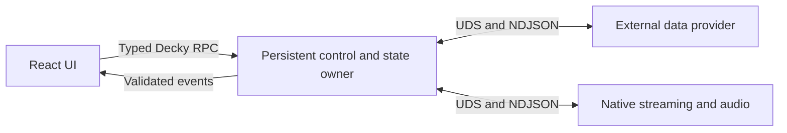

# Steam Deck Plugin Development Guide

A practical guide to building, debugging, and shipping Decky Loader plugins, based on the architecture and device failures encountered while developing **decky-music**.

This is not an official Decky specification. General engineering principles are separated from project-specific choices below. Use the current source, dependency locks, and device observations as the authority when they differ from historical notes.

## Contents

1. [Understand the host](#1-understand-the-host)
2. [Design ownership before features](#2-design-ownership-before-features)
3. [Set up a reproducible environment](#3-set-up-a-reproducible-environment)
4. [Build a thin vertical slice](#4-build-a-thin-vertical-slice)
5. [Treat IPC as a contract](#5-treat-ipc-as-a-contract)
6. [Make asynchronous work disposable](#6-make-asynchronous-work-disposable)
7. [Protect settings and diagnostics](#7-protect-settings-and-diagnostics)
8. [Design for Game Mode and controllers](#8-design-for-game-mode-and-controllers)
9. [Build and deploy the right artifacts](#9-build-and-deploy-the-right-artifacts)
10. [Debug the running Steam UI](#10-debug-the-running-steam-ui)
11. [Validate failures on the device](#11-validate-failures-on-the-device)
12. [Automate regression checks](#12-automate-regression-checks)
13. [Release the installer, not just the code](#13-release-the-installer-not-just-the-code)
14. [Use an evidence-based completion checklist](#14-use-an-evidence-based-completion-checklist)

## 1. Understand the host

A Decky plugin is not an ordinary web application with its own browser and Python environment.

- Its React UI runs inside Steam's Chromium Embedded Framework (CEF) environment. A plugin exception or expensive render can affect the host experience.
- Its Python backend runs in Decky's frozen interpreter environment. A successful import on your workstation does not prove that it will work in the plugin sandbox.
- Game Mode adds controller focus, system overlays, display scaling, audio-session routing, and suspend/resume behavior that desktop tests do not cover.
- The SSH account, the plugin's sandbox account, and the service account are not necessarily the same identity.

**Project policy:** decky-music keeps its bridge strictly standard-library-only. Third-party provider libraries and native audio dependencies live in separate executables. This is a deliberate compatibility boundary, not a claim that every Decky plugin requires multiple processes.

Use plugin-specific Python module names. We encountered a real startup failure when `import settings` resolved to the host's `decky_loader.settings` instead of our new file. The implementation is now named [`music_settings.py`](../py_modules/music_settings.py). Add a subprocess import regression that preloads conflicting host modules; a clean local interpreter alone will miss this class of failure.

The target here is x86-64 SteamOS Game Mode, not exclusively a device branded Steam Deck or an account named `deck`. Existing Steam Deck evidence must not be presented as verification of every other SteamOS device.

## 2. Design ownership before features

Decide which component remains responsible when the UI closes, a child crashes, or the user changes context.



In decky-music:

| Component | Owns | Must not own |
| --- | --- | --- |
| UI | Presentation, focus, temporary view state | Credentials, playback URLs, authoritative queue decisions |
| Bridge | Settings, account slots, queue, retries, process supervision | Provider-specific API implementation or audio decoding |
| Provider | Metadata, lyrics, authentication operations, playable URL resolution | Persistent user configuration or automatic queue advancement |
| Player | Fetching, decoding, audio output, media-service projection | Provider selection or account persistence |

Providers may keep process-local authentication state and bounded caches. Keeping persistence in the bridge does not mean that provider processes have no in-memory state.

A simple settings plugin may need only the UI and bridge. Introduce another process when isolation, dependencies, or resource ownership justify it, not to imitate a larger project's diagram.

Keep the host-facing facade small. Our [`main.py`](../main.py) exposes a callable allowlist and delegates to [`Bridge`](../py_modules/bridge.py). IPC, settings, supervision, RPC groups, normal queues, and radio behavior are separate responsibilities under `py_modules/`.

Split modules along those boundaries. Do not create a generic framework merely to satisfy a line limit, and do not retain obsolete import aliases just to avoid updating tests.

## 3. Set up a reproducible environment

For a new plugin, use the current upstream Decky development conventions and inspect a compatible template. For this repository, start with:

```bash
git clone https://github.com/jinzhongjia/decky-music.git
cd decky-music
pnpm install --frozen-lockfile
(cd qq-provider && uv sync --locked --python 3.11.16 --group dev)
```

Install the runtime versions declared by [Checks](../.github/workflows/checks.yml), rather than copying an old version list into a new machine setup. The repository also requires Git, SSH, rsync, a Rust toolchain, and an appropriate Docker or rootless Podman environment for compatible builds.

There are three distinct environments:

| Environment | Purpose |
| --- | --- |
| Workstation | Editing, deterministic tests, type checks, static analysis |
| Pinned build containers | Produce binaries compatible with the deployment ABI |
| Real SteamOS Game Mode session | Prove installation, audio, focus, rendering, and recovery |

Use lockfiles for dependencies, exact tool versions where required, checksums for downloaded executables, and immutable container digests. Do not compile with workstation-specific CPU features and assume the resulting binary is portable.

Our pnpm 9 and pnpm 11 settings intentionally coexist: the official builder and the development environment use different generations. A warning about the older configuration is not permission to delete compatibility settings.

## 4. Build a thin vertical slice

Prove the riskiest path before expanding the feature set:

1. Load a minimal plugin in Game Mode.
2. Invoke one real backend operation from the UI.
3. Return a typed result and handle its failure.
4. If a child process is required, prove its launch, connection, and shutdown.
5. Exercise the real device resource: audio output, controller input, or the relevant system integration.
6. Only then add browsing, caching, secondary screens, and convenience controls.

For an audio plugin, a beautiful player screen is not the first milestone. The first milestone is a compatible binary producing sound through the actual user's audio session.

Define an observable acceptance condition for each slice. Keep changes small enough to explain and commit by responsibility. In this repository, commits and pushes require explicit authorization, use Chinese Conventional Commit messages, and do not include assistant attribution.

## 5. Treat IPC as a contract

### Frontend to bridge

Keep all callable declarations, shared types, and event subscriptions in one API module. Here that module is [`src/api.ts`](../src/api.ts).

A TypeScript assertion does not validate runtime data. Validate the event domain, exact variant, object shape, required fields, enum values, nullable objects, and finite numbers **before** calling subscribers. Unknown or malformed events should not mutate state or throw into Steam.

Change both sides of a contract together. Our [callable contract tests](../tests/test_callables.py) keep the frontend declarations, backend methods, and facade allowlist aligned.

### Bridge to children

Our protocol uses Unix-domain sockets, with the bridge as server and one JSON message per line. These are example protocol-v1 frames, not a single JSON document:

```jsonl
{"id":7,"cmd":"pause","args":{}}
{"id":7,"ok":true,"data":{}}
{"id":8,"ok":false,"error":{"code":"upstream_timeout","message":"upstream_timeout"}}
{"ev":"player","type":"paused","data":{"pos":12.5}}
{"ev":"log","level":"info","where":"load","msg":"stream opened"}
```

Centralize framing, parsing, and construction. Bound frame size; the current project limit is 1 MiB. Treat oversized or malformed input as a controlled failure, not a reason to dump the raw frame into logs.

Use request IDs to match concurrent responses. Hold the write lock only while committing a frame, not for the complete upstream request. Consume ordered domain events separately from the response reader: an event callback that requests another operation must not deadlock the reader it is waiting on.

Connection identity matters independently of request IDs. Bind queued work to an immutable connection/session origin. Old EOF, responses, QR events, or login success must not act on a replacement connection. Our provider socket path changes with its session; discover the actual `--socket` argument instead of hardcoding `provider.sock` in diagnostic tools.

## 6. Make asynchronous work disposable

Cancellation has two responsibilities: preventing stale effects and reclaiming resources. One does not imply the other.

### Fence user intent

For source changes, logout, replacement login, queue clearing, and other superseding actions:

1. Invalidate the old intent before the first suspension point.
2. Capture its generation or immutable origin.
3. Recheck after asynchronous work and immediately before state writes, persistence, event publication, or command submission.
4. Cancel and reap work owned by the superseded intent.
5. Never stop newer work merely because an older request finally completed.

Use deterministic barriers to test the dangerous ordering: hold an old result, perform the new action, then release the old result. Assert externally visible state and events, not just that a cancellation method was called.

### Isolate cancellation domains

We found that an upstream Python timeout implementation could handle its own cancellation while leaving the task's cancellation counter set. Treating that counter as proof of user cancellation silently discarded valid QR results.

The current [QQ login implementation](../qq-provider/qq/login.py) runs upstream awaits in separate tasks. Internal timeout bookkeeping stays in the upstream task, while the authentication task still propagates genuine external cancellation. Generation checks remain necessary when a dependency consumes cancellation and returns a late result.

Do not fix this by indiscriminately clearing cancellation counters or swallowing every `CancelledError`.

### Budget the whole operation

A sequence of individually bounded requests can still exceed its caller's deadline. Give the complete operation an absolute deadline and pass its remaining budget to nested work.

Current project examples, not universal constants:

- Bridge request wait: 30 seconds.
- NCM command: 25 seconds total; an upstream stage gets at most 15 seconds and never more than the remaining budget.
- Player initial headers: at most two 10-second attempts with a 1-second backoff.
- Player empty-buffer stall: 30 seconds; there is no short whole-song body deadline.

Distinguish `upstream_timeout` from an unresponsive child connection. Do not increase every timeout to hide a missing command-level budget.

### Bound real work

Dropping a handle to blocking I/O does not necessarily stop the I/O. Own and cancel the header/body tasks, join obsolete work where required, and bound active loads. Our player has a two-permit loading limit and generation-fences audio events as well as decoder handoff.

Keep failure distinct from EOF. A stalled stream must preserve an observable failure so it cannot accidentally become a normal completion and advance the queue. Test that stop/drop closes connections and releases retained buffers; measure resources instead of assuming cancellation freed them.

## 7. Protect settings and diagnostics

Treat a settings file as untrusted input even when it contains valid JSON. An array, wrong version, invalid provider, malformed nonempty queue index, or nonfinite value must not crash startup.

- Normalize the concrete schema at the boundary.
- Reject invalid control inputs before persistence, spawning, or state mutation.
- Check representational limits across languages: a finite Python number may still overflow a Rust duration.
- Preserve valid account data and persist only approved queue fields, never signed playback URLs.
- Create temporary settings files privately, write them, and atomically replace the destination. Preserve `0600` permissions, including an already-existing temporary file.

Diagnostics are a separate trust boundary. Use stable codes, fixed safe phrases, known categories, and necessary numeric facts. Do not interpolate third-party exception text, arbitrary command names, response bodies, cookies, or credentials.

In decky-music, `decky.logger` is the single persistence sink; child diagnostics travel through structured IPC. The bridge summarizes untrusted free text and stderr rather than storing them verbatim. Logs are English; user-facing errors are localized. Unknown errors get a safe generic message.

Test with synthetic secret markers in provider errors, structured logs, stderr, and UI fallbacks. The marker must not escape through diagnostics. Legitimate credential transport for authentication is different: it must reach the bridge privately, but must not be forwarded to the UI as a login-success payload.

## 8. Design for Game Mode and controllers

Use Decky's focus-aware components rather than making a mouse UI that merely happens to run on the Deck.

General rules:

- Every action must be reachable without touch or hover.
- Give overlays an independent focus scope and restore focus when they close.
- Preserve the next focus target across virtual-window changes.
- Handle soft-keyboard resize and different display scales.
- Keep Steam's global chrome, Steam button, and QAM button system-owned.
- Use the system Footer Legend through action descriptions; do not draw a lookalike footer.
- Put error boundaries around plugin surfaces and handle asynchronous failures separately.

Our layout uses top-level horizontal tabs and full-width content, with no persistent sidebar or fixed bottom MiniPlayer. The Quick Access Menu (QAM) handles provider/account/settings operations; `/music` handles browsing and playback.

Our controller mapping is project-specific:

| Input | Convention |
| --- | --- |
| A / B | Activate / back or close |
| X / Y | Contextual action / queue; radio pages may override these |
| Start | Play/pause only when meaningful |
| L1/R1 | Top-level tabs |
| L2/R2 | Secondary tabs or contextual paging |
| D-pad / left stick | Focus navigation and slider adjustments |

### Virtualize using actual geometry

Separate content height from row stride. For `N` rows with height `h` and gap `g`, the full-list height is `N*h + max(0, N-1)*g`. Do not add an outer flex gap around spacer elements on top of that model.

Our actual row content is 64px, not the earlier 72px estimate. CEF scaling also quantizes fractional gaps, so multiplying the nominal gap can accumulate position errors. [`Windowed.tsx`](../src/ui/Windowed.tsx) calibrates rendered stride on layout changes rather than measuring every scroll frame.

Compare virtual windows with a fully rendered reference, including the first/last row and partially visible rows. Then test controller movement across overscan boundaries and appended pages on the device. An arithmetic unit test alone will not detect every CSS or focus problem.

### Give stores an explicit lifetime

Start module-level stores from plugin initialization and stop them on dismount. Keep unsubscribe functions, clear timers, and fence stale hydration and action failures. A replaced host listener map does not clean up your timers or promises.

Our [plugin entry](../src/index.tsx) owns `startPlayer`/`stopPlayer`; [lifecycle tests](../tests/playerLifecycle.test.mjs) verify restart, stale completion, and debounce behavior.

## 9. Build and deploy the right artifacts

All commands below run from the repository root.

```bash
# Rebuild every runtime whose code or dependencies changed.
bash scripts/build-rust.sh -p player
bash scripts/build-rust.sh -p ncm-provider
bash scripts/build-qq-provider.sh

# Explicit artifact checks; build scripts also run their applicable checks.
python3 scripts/check-binaries.py \
  target/release/player target/release/ncm-provider \
  qq-provider/build/qq-provider.tar.gz
```

The current project ABI gate checks x86-64 ELF, a glibc requirement no newer than 2.39, and allowed dynamic dependencies, including ELF files inside the QQ archive. The plugin's stated runtime boundary is glibc 2.39 or newer. These are project constraints, not a promise about every SteamOS release.

For the player, the application-specific native dependency is `libasound`; normal platform libraries such as libc, libm, and libgcc may also be present. ABI checks do not prove audio routing or audible output.

Package through the pinned helper:

```bash
bash scripts/decky-build.sh

# Alternative for an existing rootless Podman setup; this only builds a package.
DECKY_BUILD_SUDO=0 DECKY_BUILD_ENGINE=podman \
  bash scripts/decky-build.sh --build-as-root
```

The helper verifies cached/downloaded CLI bytes and the builder digest. It stages Git-visible working-tree files, including uncommitted source, instead of copying `target/`, Nuitka output, virtual environments, and ignored secret files into the build input. This avoided multi-gigabyte scratch copies and quota failures in our development loop. It is not a secret scanner: never commit secrets in the first place.

### Authorized deployment sequence

1. Confirm the current target address and SSH identity; do not embed a personal IP or username in scripts.
2. Save the current source, queue, position, and volume privately if the test will change them. Do not print credentials.
3. Obtain deployment permission and define the fault-injection scope.
4. Preflight the service, sandbox account, destination, and sudo access before downloads, builds, or replacement.
5. Rebuild changed binaries, package, deploy, and verify installed hashes.
6. Check actual startup and account/playback behavior before declaring the deployment successful.

```bash
# Set DECK_HOST in this shell to the confirmed user@host before running.
: "${DECK_HOST:?Set DECK_HOST to the confirmed SteamOS SSH target}"
export DECK_HOST
python3 scripts/deploy_target.py preflight --name "Decky Music"
bash scripts/deploy.sh
```

If remote sudo needs a password, provide `DECK_PASS` through the authentication environment, not a source file or a literal command recorded in history. `DECK_PLUGIN_PATH` is an explicit override for an existing plugins directory, not a substitute for correct account discovery.

**Important:** `deploy.sh` copies existing runtime artifacts; it does not rebuild them. All three must be available. It also clears local `out/`, `dist/`, and `/tmp/decky`, and restarts `plugin_loader`. Do not store hand-authored data in those build locations, and remember that restarting the service affects other loaded plugins too. The full deploy script still uses host sudo; the rootless packaging example is not a rootless deployment command.

Never infer the install directory from the SSH user's home. Our deploy helper discovers it from service configuration and validates the plugin's sandbox owner. Keep the plugin root read-only; grant only the access required by the installation layout, such as archive extraction under `bin/`. Do not use `chmod 777` as a repair strategy.

## 10. Debug the running Steam UI

### Keep the device awake, then release it

Use a bounded blocker in the relevant user's session, not an untracked background process:

```bash
ssh "$DECK_HOST" 'systemd-run --user --unit decky-dev-nosleep --collect systemd-inhibit --what=idle:sleep --who=decky-dev --why=verification sleep 3600'
ssh "$DECK_HOST" 'systemctl --user is-active decky-dev-nosleep && systemd-inhibit --list --mode=block'

# Run this when finished, even if a test failed.
ssh "$DECK_HOST" 'systemctl --user stop decky-dev-nosleep'
ssh "$DECK_HOST" 'systemd-inhibit --list --mode=block'
```

Starting the unit does not prove the inhibitor is already active: inspect it after startup. After a long pause, reboot, or lost SSH session, recheck both the address and blocker state. Never leave an unbounded inhibitor running overnight.

The `idle:sleep` blocker also blocks intentional suspend. Remove it before the user presses Power or tests sleep/resume. A blocked sleep transition can leave Steam's own suspend overlay holding focus even while JavaScript timers continue running; inspect the host's suspend/resume state instead of assuming the plugin's event loop has frozen.

### Connect through a local-only CDP tunnel

Steam's CEF commonly exposes the Chrome DevTools Protocol (CDP) on device port 8080 in Decky development setups. Verify that it is available; do not expose it to the network.

```bash
# Keep this running in a dedicated terminal; Ctrl-C closes the tunnel.
ssh -N -o ExitOnForwardFailure=yes \
  -L 127.0.0.1:8080:127.0.0.1:8080 "$DECK_HOST"
```

In another terminal, from the repository root, run the following on the authorized test device. These commands operate the real Steam UI; the final command may activate the focused control.

```bash
node .agents/skills/steam-cdp/scripts/cdp.mjs targets
node .agents/skills/steam-cdp/scripts/cdp-nav.mjs /music
node .agents/skills/steam-cdp/scripts/cdp-shot.mjs bp /tmp/decky-music-check.png
node .agents/skills/steam-cdp/scripts/cdp-key.mjs bp ArrowDown Enter
```

The bundled wrappers use local port 8080. For another port, use the explicit `baseUrl` option in `cdp-lib.mjs` or a suitably configured CDP client; changing an unrelated environment variable will not reconfigure the wrappers.

Use `shared` for backend/module inspection and `bp` for the visible Game Mode surface. QAM and main-menu overlays have separate targets and may only render while open. Re-discover targets after Steam or its web context restarts.

A read-only probe, saved to a temporary JavaScript file and run with `cdp.mjs shared`, can limit its output to operational state:

```js
(async () => {
  const state = await DeckyBackend.call(
    "loader/call_plugin_method", "Decky Music", "get_playback"
  );
  return { playing: state.playing, position: state.pos, index: state.index };
})()
```

`DeckyBackend` and loader internals are diagnostic surfaces, not APIs to ship in plugin code. Production UI should use `@decky/api` through its central typed wrapper.

Practical CEF lessons:

- Observe the current page before acting; re-renders invalidate element references.
- DOM presence is not proof that an element is visible or actionable.
- Match labels with count badges by semantic prefix when appropriate.
- Raw route navigation can help when a normal navigation helper lacks a focused window. Re-entering the same route does not guarantee a remount.
- After changing providers, confirm both backend identity and the visible provider shell. Cached pages can otherwise produce mislabeled screenshots.
- Do not call the internal API `connect` method just to inspect a plugin; it replaces listener ownership. Use a deliberate frontend reload when that is the intended test.
- A single DOM read proves existence, not liveness. Sample changing state or perform an action and observe its result.

### Diagnose from current logs

Use the runtime's `DECKY_PLUGIN_LOG_DIR`; a conventional homebrew path is only a hint. Select the log for the current service session, not an older successful deployment. Inspect `journalctl -u plugin_loader` locally when plugin initialization fails before ordinary RPCs are available, and sanitize anything shared outside the device.

For audio, verify the actual process user, a valid user-owned `XDG_RUNTIME_DIR`, PipeWire availability, selected output, and mute state. Do not create an empty runtime directory as a substitute for a real audio session. [`session_env.py`](../py_modules/session_env.py) documents the project's checks.

## 11. Validate failures on the device

Use isolated temporary settings and synthetic credentials for destructive tests. Do not log out a real account, alter real playlists, or disconnect the whole machine merely to test a plugin boundary.

| Scenario | Required observation |
| --- | --- |
| Old URL/login result released after clear, logout, or source change | No stale state write, command, or success event |
| Old connection EOF after replacement | New connection and its requests remain usable |
| Server accepts but sends no headers | New load/stop cancels old work promptly; no obsolete retry |
| Server sends partial body and stalls | Failure remains distinct from EOF; stop/drop releases resources |
| Malformed settings or events | Safe normalization/rejection; Steam remains responsive |
| Backend killed | Recoverable UI state and working restart/reload path |
| Plugin reload during debounce or hydration | No delayed RPC, stale toast, or overwritten current state |
| Long list crosses windows and pages | Stable geometry, reachable next row, preserved back/overlay focus |
| Missing artwork or network failure | Recoverable fallback and usable navigation |
| Suspend/resume or output-device change | Correct reconnection and audio-session behavior |

Define cleanup before injection. Track exact processes, restore temporary interceptors in `finally`, remove temporary QR images/configuration, restore user state where supported, and release sleep protection. If a state cannot be restored exactly, disclose the difference rather than claiming full restoration.

### Keep evidence categories separate

- Unit tests prove modeled behavior, not real Steam integration.
- ABI checks prove a binary boundary, not sound or controller support.
- Advancing playback anchors are evidence of an active pipeline, not proof that the speaker is unmuted.
- A `playing` event latency is not a microphone measurement of audible onset.
- RPC bytes are not upstream response bytes; fewer bytes may come with more requests.
- RSS may retain allocator high-water memory after buffers are released. Correlate RSS with owned tasks, live connections, descriptors, and buffer-lifetime checks.
- A screenshot proves appearance at one instant, not absence of an animation or a focus race.

### Preserve real screenshots

For this project, visual, text, layout, or focus changes require corresponding raw device PNGs under `docs/ui-design/assets/device-screenshots/`. Shared changes require both QQ and NCM coverage. Keep stable names and Git LFS tracking.

Read the captured images. Reject wrong-provider shells, mixed transition frames, and unintended loading states. A genuine empty account result is valid evidence; do not fabricate content to make the screenshot look populated.

Presentation renders are derived assets, not acceptance evidence. After updating originals, explicitly request regeneration of the corresponding renders. See the [current screenshot register](ui-design/README.md).

## 12. Automate regression checks

Use the repository's current commands and keep tests deterministic:

```bash
python3 -m unittest discover -s tests
(cd qq-provider && uv run --locked python -m unittest discover -s tests)
(cd qq-provider && uv run --locked ruff check .)
pnpm test:ui
pnpm lint
pnpm build
cargo fmt --all -- --check
cargo test --workspace --locked
cargo clippy --workspace --all-targets --locked -- -D warnings
```

Use the Python and Rust versions pinned in CI for parity. Do not mix real QR scanning or uncontrolled Internet waits into the unit suite. Real-provider/device smoke tests belong in a separately controlled acceptance step.

Keep permanent tests when they catch plausible regressions: races, precedence, boundaries, failure propagation, ownership, or security disclosure. Avoid tests that only check source strings, forwarding echoes, or incidental wording. Temporary scripts are appropriate for one-off resource measurements and deployment experiments.

Validate CI itself. Our workflow was tested with successful PR/push runs, a deliberately failing test on a temporary branch, and successful runs after removing the failure. A red workflow is not the same as configured branch protection; do not claim or change repository governance implicitly.

Run local checks once changes settle, then verify the integrated tree. Successful individual component checks do not replace integration testing in the frozen host.

## 13. Release the installer, not just the code

A sideload and a release installation exercise different paths. The release path must cover downloading, checksums, permissions, first-run extraction, startup, and actual behavior.

For decky-music:

1. Start from reviewed, tested, device-verified changes and an authorized release request.
2. Distinguish a runtime-binary change from a zip-only bridge/UI/documentation change.
3. Update version metadata and applicable locks consistently.
4. Rebuild changed native/provider artifacts, hash the actual outputs, upload them, and update tag-pinned `remote_binary` entries.
5. Let the release workflow build installers, then download and inspect the published files.
6. Check normal, self-contained/full, and CN variants against their intended manifests and hashes.
7. Exercise an actual release installation; transferring a ZIP or successfully sideloading is not installer acceptance.

A `remote_binary` archive is downloaded as bytes; extraction is the plugin's responsibility. Validate archive paths, expected executables, permissions, and the sandbox's ability to perform first-run extraction. Never fix ownership failures by making the whole plugin writable.

If binary contents did not change, a zip-only release may intentionally retain the previous binary URLs and hashes. If runtime code changed, reusing old assets is not acceptable. A tag or frontend version bump does not prove the installed executable is current.

**Project delivery policy:** stable releases also deliver all three versioned installers to the confirmed device's Downloads directory and compare remote hashes and sizes. Discover that directory for the target user; do not hardcode `/home/deck/Downloads`. Prereleases do not require this transfer by default. Delivery does not authorize installation or service restart, and an unavailable device must be reported as incomplete delivery rather than silently skipped.

Use the current [release procedure](../.agents/skills/release/SKILL.md) and [release workflow](../.github/workflows/release.yml) for exact mechanics; keep their instructions aligned with current tests and source rather than repeating obsolete troubleshooting assumptions.

## 14. Use an evidence-based completion checklist

Before calling a change complete:

- [ ] Ownership and external contracts remain explicit; all affected callers were migrated.
- [ ] Appropriate deterministic regressions and local checks pass.
- [ ] Changed runtime binaries were rebuilt and installed hashes were verified.
- [ ] Relevant Game Mode behavior, controller flow, and failure recovery were exercised.
- [ ] Audio output was actually confirmed when the audio path changed.
- [ ] Synthetic secrets do not appear in diagnostic outputs.
- [ ] Required raw screenshots are current; derived renders are not misrepresented.
- [ ] Temporary processes, interceptors, files, and sleep inhibitors are cleaned up.
- [ ] User state is restored where possible, and any remaining difference is disclosed.
- [ ] Documentation links, commands, and implementation names match the current tree.
- [ ] Commit, push, issue closure, and release actions match the authorization actually given.
- [ ] Any blocked criterion is explicitly recorded instead of reported as passed.

For further detail, read the [architecture](DESIGN.md), [queue behavior](QUEUE-BEHAVIOR.md), [device acceptance history](ROADMAP.md), [controller/UI rules](ui-design/specs/steam-deck-ui-rules.md), and the repository's [development rules](../AGENTS.md).

Upstream starting points: [Decky Loader](https://github.com/SteamDeckHomebrew/decky-loader), [Decky CLI](https://github.com/SteamDeckHomebrew/cli), [Decky UI](https://github.com/SteamDeckHomebrew/decky-frontend-lib), and the checked-in [device workflow](../.agents/skills/decky-dev/SKILL.md) and [CDP tools](../.agents/skills/steam-cdp/SKILL.md).
